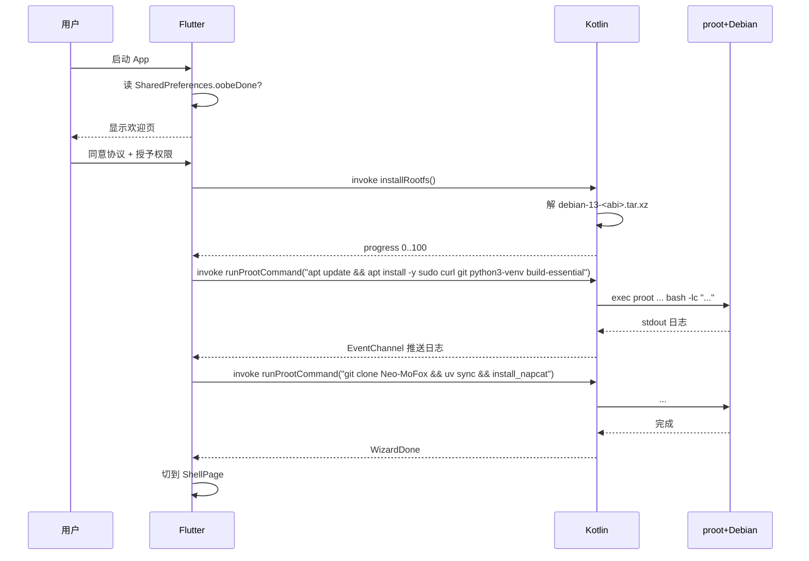
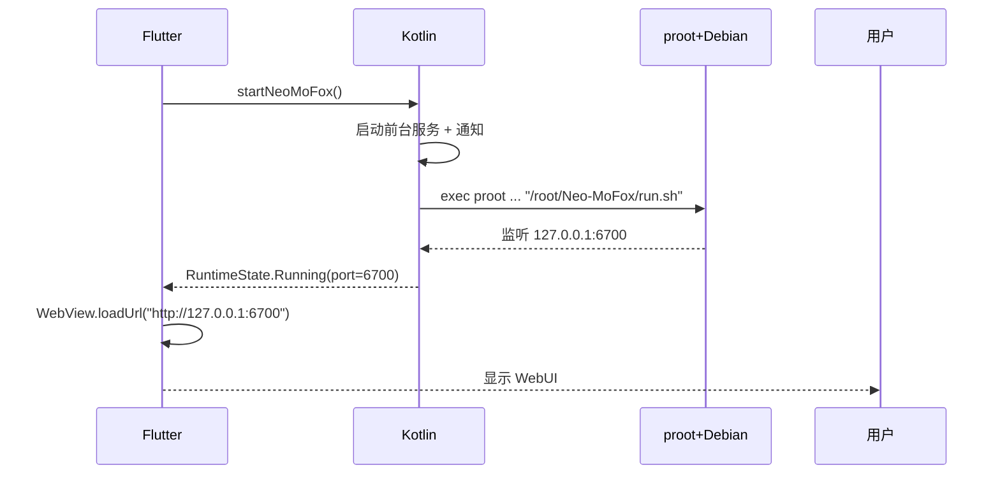
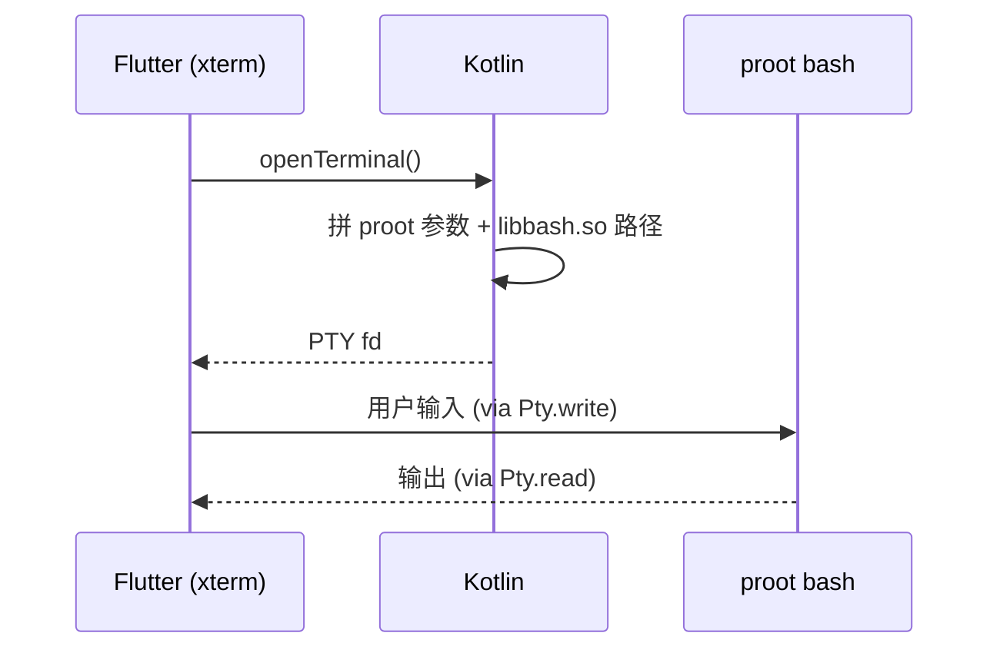

# MoFox-Android 架构总览

> 本文档是 MoFox-Android 安卓壳的**单一真实来源**。任何对运行时方案、UI 结构、技术栈或目录约定的改动，都必须先更新本文档再落代码。

---

## 1. 项目定位

MoFox-Android 是 [Neo-MoFox](https://github.com/MoFox-Studio/Neo-MoFox) 的安卓原生外壳：

- **主界面**：Flutter + WebView 套自家 WebUI（保持桌面端一致体验）。
- **原生层**：Kotlin 负责 OOBE、内嵌 Linux 运行时、终端、保活、系统级设置。
- **运行时**：通过 `jniLibs` 投放原生二进制 + `proot` rootless 容器 + **Debian 13 (trixie)** rootfs，跑 Neo-MoFox 主程序与 NapCat。

**不依赖 Termux**，App 自带完整运行时，安装即可用。

---

## 2. 设计目标

| 目标 | 说明 |
| --- | --- |
| **零外部依赖** | 不需要安装 Termux 或任何辅助 App，APK 自带所有原生二进制与 rootfs。 |
| **包名无关** | 原生二进制通过 `jniLibs` 由 Android 解包，路径可执行（W^X 友好），与 `applicationId` 解耦。 |
| **真发行版** | 内嵌完整 Debian 13 (trixie) rootfs，可直接 `apt install`，与桌面端开发体验一致。GNU coreutils 单文件分发，避开 util-linux 的 `/proc/self/exe` 自分派陷阱（与 proot loader 注入冲突，会触发 `unknown program 'libloader'`）。 |
| **WebUI 复用** | 主界面直接套 Neo-MoFox WebUI，避免双端 UI 维护。 |
| **保活** | 前台服务 + 通知 + （可选）自启，最大化降低后台被杀概率。 |
| **可测试** | OOBE / 运行时 / WebView / 终端均有单元或集成测试覆盖。 |

---

## 3. 技术栈

| 层 | 技术 | 备注 |
| --- | --- | --- |
| UI 框架 | **Flutter 3.22+** / Dart 3.4+ | Material 3 + Android 12+ Dynamic Color |
| 状态管理 | **Riverpod 2 (Notifier / AsyncNotifier)** | OOBE 向导、运行时状态、WebView 控制器 |
| 路由 | **go_router** | 三 Tab：管理 / 终端 / 设置 |
| 终端 | **xterm.dart + flutter_pty** | PTY 直接连到 proot 内 bash |
| 内嵌运行时 | **jniLibs 原生二进制 + proot + Debian 13 (trixie) rootfs** | 详见 §5.3 |
| 原生桥接 | **MethodChannel + EventChannel** | `mofox/runtime` / `mofox/runtime/events` |
| 持久化 | `shared_preferences` + `flutter_secure_storage` | OOBE 状态、Token |
| WebView | `webview_flutter` (Android `WebView`) | 复用 Cookie / 局域 IPC |
| 保活 | `flutter_foreground_task ^9.1.0` | 前台服务 + 通知 |
| 解压 | `archive ^4.0.7` + `tar ^2.0` | 解 rootfs `.tar.xz` |
| 网络下载 | `dio` | 离线包 / 镜像下载 |
| 权限 | `permission_handler` | 通知 / 存储 / 自启 |
| 构建 | Gradle 8 + AGP 8 + Kotlin 1.9 | targetSdk **35**, minSdk 24 |

---

## 4. 整体架构

```
┌─────────────────────────────────────────────────────────────┐
│                    Flutter (Dart) UI 层                      │
│  ┌───────────┐  ┌───────────┐  ┌───────────┐                │
│  │  OOBE     │  │  WebView  │  │  Terminal │                │
│  │  Wizard   │  │  Shell    │  │  (xterm)  │                │
│  └─────┬─────┘  └─────┬─────┘  └─────┬─────┘                │
│        │              │              │                      │
│        └──────────────┴──────────────┘                      │
│                       │                                     │
│         Riverpod Notifier / AsyncNotifier                   │
└───────────────────────┼─────────────────────────────────────┘
                        │ MethodChannel / EventChannel
┌───────────────────────┼─────────────────────────────────────┐
│              Kotlin (Android 原生) 运行时层                  │
│                                                             │
│  RuntimeMethodChannelHandler                                │
│   ├── getNativeLibraryDir()  ← jniLibs 解包后的二进制目录   │
│   ├── installRootfs()         ← 解 debian-13-<abi>.tar.xz   │
│   ├── runProotCommand(script) ← 拼 proot 命令并 exec        │
│   └── streamLogs()             ← EventChannel              │
│                                                             │
│  RootfsInstaller   RuntimeCommandBuilder   ProcessSupervisor│
└───────────────────────┼─────────────────────────────────────┘
                        │ exec
┌───────────────────────┼─────────────────────────────────────┐
│      jniLibs (Android 解包到 nativeLibraryDir，可执行)      │
│   libbash.so  libbusybox.so  libproot.so                    │
│   libsudo.so  libloader.so   liblibtalloc.so.2.so           │
└───────────────────────┼─────────────────────────────────────┘
                        │ proot -0 -r <rootfs>
┌───────────────────────┼─────────────────────────────────────┐
│         Debian 13 (trixie) rootfs (内嵌 .tar.xz)            │
│   /usr/bin/apt   /usr/bin/python3   /root/Neo-MoFox/...     │
│   NapCat   uv venv   sqlite3                                │
└─────────────────────────────────────────────────────────────┘
```

---

## 5. 关键模块详解

### 5.1 OOBE 向导（`app/lib/features/wizard/`）

首启五步（Riverpod `WizardNotifier`）：

1. **欢迎与隐私同意**：展示品牌、协议（AGPL-3.0），获取必要权限（通知、存储）。
2. **环境检查**：ABI 是否支持（`arm64-v8a` / `armeabi-v7a` / `x86_64`）、磁盘空间是否 ≥ 1.5 GB、Android 版本 ≥ 7（API 24）。
3. **安装运行时**：解包 jniLibs（系统自动完成）、解压 Debian 13 (trixie) rootfs、首次启动 proot、配置镜像源、`apt update && apt install` 基础工具链。
4. **安装 Neo-MoFox 与 NapCat**：在 rootfs 内 `git clone Neo-MoFox`、`uv sync`、安装 NapCat、写入默认配置。
5. **完成与进入主界面**：注册前台服务，引导用户开启自启与电池白名单。

每一步使用 Riverpod `AsyncNotifier` 暴露 `WizardState`：

```dart
sealed class WizardState {
  const WizardState();
}
class WizardIdle extends WizardState {}
class WizardRunning extends WizardState {
  final InstallTask task;
  final double progress;
  final List<String> logs;
}
class WizardError extends WizardState {
  final String message;     // 已格式化的错误，含 PlatformException code
  final InstallTask failedAt;
}
class WizardDone extends WizardState {}
```

错误格式化：捕获 `PlatformException` 时拼接 `"$msg ($code)"`，避免静默挂起。

### 5.2 WebView 主壳（`app/lib/features/shell/`）

- 默认 URL：`http://127.0.0.1:<port>`，端口由 Neo-MoFox 主程序在 rootfs 内绑定。
- Cookie 持久化：`webview_flutter` + `CookieManager`，与 `flutter_secure_storage` 中的登录态同步。
- 与原生通信：JavaScript Bridge `MoFox.native.*`，转发到 MethodChannel。
- 启动时机：等待 `RuntimeStateProvider` 进入 `Running` 后再 `loadUrl`，避免端口未就绪。

### 5.3 内嵌运行时（`app/android/app/src/main/kotlin/com/mofox/android/runtime/`）

#### 5.3.1 jniLibs 二进制投放

Android 在安装时把 `src/main/jniLibs/<abi>/lib*.so` 解包到 `applicationInfo.nativeLibraryDir`（典型路径：`/data/app/~~xxx==/com.mofox.android-yyy==/lib/arm64`）。**该目录是少数 W^X 默认豁免的可执行路径之一**，绕过 SELinux 对 `/data/data/<pkg>/files/**` 的禁止执行限制。

利用这点，把所有原生二进制伪装成 `.so` 投递：

| jniLibs 文件名 | 实际作用 |
| --- | --- |
| `libbash.so`            | bash 解释器 |
| `libbusybox.so`         | BusyBox 工具集（`mkdir/cp/ln/...`） |
| `libproot.so`           | proot rootless 容器 |
| `libsudo.so`            | proot 内的 sudo 替身（**严禁 strip**） |
| `libloader.so`          | proot 的 ELF loader（`PROOT_LOADER`） |
| `liblibtalloc.so.2.so`  | proot 依赖的 talloc.so.2，**双 lib 前缀**让 Android 仍按 jniLibs 解包 |

`build.gradle.kts` 关键配置：

```kotlin
android {
    defaultConfig {
        targetSdk = 35
        minSdk = 24
        ndk {
            abiFilters += listOf("arm64-v8a", "armeabi-v7a", "x86_64")
        }
    }
    packaging {
        jniLibs {
            useLegacyPackaging = true   // = AndroidManifest extractNativeLibs="true"
            keepDebugSymbols += listOf("**/libsudo.so")
        }
    }
}
```

`AndroidManifest.xml`：

```xml
<application
    android:extractNativeLibs="true"
    ... >
```

#### 5.3.2 rootfs 安装（`RootfsInstaller.kt`）

启动时检查 `filesDir/usr/var/lib/proot-distro/installed-rootfs/ubuntu/.installed` 标记（路径中的 `ubuntu` 是历史命名，实际是 Debian 13 rootfs，不强行重命名以减少改动面）：

1. 不存在 → 从 `assets/rootfs/debian-13-<abi>.tar.xz` 解压到该路径下（约 ~290 MB 解压后）。
2. 解压使用 Kotlin `XZCompressorInputStream` + `TarArchiveInputStream`，保留 symlink、权限位；硬链接由 proot 的 `--link2symlink` 在运行期透明转译。
3. 解压完成后写 `.installed` + `version.txt`。
4. 后续 OOBE/启动跳过此步。

> **rootfs 来源**：[LXC images](https://images.linuxcontainers.org/) 的 `debian/trixie/<arch>/default/` 每日构建，文件已经是 `rootfs.tar.xz` 不需要重压。`python tools/build.py --fetch-rootfs` 会自动列目录抓最新时间戳并下载，按优先级走清华 → BFSU → 上游官方三个镜像。下载产物按 `debian-13-<arm64|armhf|amd64>.tar.xz` 命名落到 `app/assets/rootfs/`。codename `trixie` 写死在 `RuntimeScripts.UBUNTU_CODENAME`。
>
> **为什么不用 Ubuntu**：Ubuntu 24.04+ 的 coreutils 是 util-linux 风格的多调用单 ELF（通过 `/proc/self/exe` 解析 argv[0] 来分派子命令），proot 的 loader 注入会让 `/proc/self/exe` 指向 `libloader.so`，触发 `coreutils: unknown program 'libloader'`。Debian 仍然走 GNU coreutils 单工具单 ELF 的传统路线，与 proot 兼容。
>
> **apt 镜像**：默认指向华为云 `mirrors.huaweicloud.com/debian/` 与 `mirrors.huaweicloud.com/debian-security/`，配置 `main contrib non-free non-free-firmware` 全套组件，写死在 `RuntimeScripts.changeUbuntuSourceFn` 中，OOBE 第 3 步执行。

#### 5.3.3 proot 命令拼装（`RuntimeCommandBuilder.kt`）

不使用 `proot-distro`，直接调用 `proot`：

```bash
NATIVE=$applicationInfo.nativeLibraryDir
ROOTFS=$filesDir/usr/var/lib/proot-distro/installed-rootfs/ubuntu
TMPDIR=$cacheDir/tmp

PROOT_LOADER="$NATIVE/libloader.so" \
LD_LIBRARY_PATH="$NATIVE" \
PROOT_TMP_DIR="$TMPDIR" \
exec "$NATIVE/libproot.so" \
    -0 -r "$ROOTFS" --link2symlink \
    -b /dev -b /proc -b /sys -b /dev/pts \
    -b "$TMPDIR":"$TMPDIR" -b "$TMPDIR":/dev/shm \
    -b /proc/self/fd:/dev/fd \
    -b /storage/emulated/0:/sdcard \
    $FAKE_PROC_BINDS \
    -w /root \
    /usr/bin/env -i \
        HOME=/root \
        TERM=xterm-256color \
        LANG=en_US.UTF-8 \
        TZ="$ANDROID_TZ" \
        PATH=/usr/local/sbin:/usr/local/bin:/usr/sbin:/usr/bin:/sbin:/bin \
        "$NATIVE/libbash.so" -lc "$USER_SCRIPT"
```

要点：

- `-0`：把当前 uid 映射为 root（rootless 假 root）。
- `-r`：根切到 rootfs。
- `--link2symlink`：把硬链接转为软链接（rootfs 内 apt 大量用硬链接，但 Android `/data` 不允许跨设备硬链接）。
- `-b`：bind mount，关键的有 `/dev`、`/proc`、`/sys`、`/dev/pts`，以及把 Android 的 sdcard 映射到 `/sdcard`。
- `PROOT_LOADER` / `LD_LIBRARY_PATH` / `PROOT_TMP_DIR` 必须显式设置，否则 proot 找不到自己的 loader。
- `env -i` 清空环境再注入白名单，避免 Android 环境变量污染。
- 调用 `libbash.so` 而不是 rootfs 内的 `/bin/bash`，因为容器还没进去之前需要先有 shell 来 exec proot。

#### 5.3.4 假 /proc 数据（`setup_fake_sysdata`）

部分 Android 设备禁止读 `/proc/loadavg` `/proc/stat` `/proc/version`。运行时在 rootfs 启动前：

1. 写假数据到 `filesDir/fake_proc/{loadavg,stat,version,...}`。
2. 仅当宿主对应文件**不可读**时，追加 `-b $fake/loadavg:/proc/loadavg` 等 bind mount。
3. 否则不绑（保留宿主真实数据）。

#### 5.3.5 进程管理（`RuntimeProcessManager.kt`）

- 通过 `ProcessBuilder` 起 proot，`stdout/stderr` redirect 到 PTY 或日志管道。
- 用 `flutter_foreground_task` 注册前台服务，宿主进程被杀时优先恢复。
- 子进程退出时：
  - 正常退出 → 标记 `Stopped`，UI 弹出"已停止"。
  - 异常退出（return code != 0） → 收集最后 200 行日志，发到 EventChannel，UI 显示崩溃面板。
- 重启策略：用户手动触发，**不**自动重启避免日志风暴。

### 5.4 终端（`app/lib/features/terminal/`）

- xterm.dart 渲染，flutter_pty 提供 PTY。
- `Pty.start("$nativeLibraryDir/libbash.so", arguments: [...proot 参数...], environment: {...})`，参数同 §5.3.3。
- 终端是独立 PTY，与 §5.3.5 主 Neo-MoFox 进程**不共享**。用户可以在终端里 `apt install`、`htop`、`tmux a`，主进程不受影响。

### 5.5 设置（`app/lib/features/settings/`）

- 主题（跟随系统 / 强制亮色 / 强制暗色 / Material You 动态色）。
- 自启与电池白名单（跳转系统页）。
- 镜像源切换（华为云 / 清华 / 中科大 / 阿里 / 官方），写入 rootfs 内 `/etc/apt/sources.list`。默认华为云。
- Neo-MoFox 配置（端口、Token、自动启动等），通过 MethodChannel 写到 rootfs 内 `/root/Neo-MoFox/config.toml`。
- 重置（清空 `filesDir/usr/`、重跑 OOBE）。

---

## 6. 关键流程

### 6.1 首启 OOBE



### 6.2 主程序运行



### 6.3 终端会话



---

## 7. 目录结构

```
MoFox-Android/
├── ARCHITECTURE.md                    # 本文档
├── README.md                          # 快速上手
├── LICENSE                            # AGPL-3.0
├── tools/
│   └── build.py                       # 构建脚本（pub get + build apk + 复制产物）
├── dist/                              # CI / 本地构建产物（不入仓）
└── app/
    ├── pubspec.yaml
    ├── analysis_options.yaml
    ├── lib/
    │   ├── main.dart
    │   ├── app/                       # Material App、路由、主题、Provider 根
    │   ├── core/                      # 工具、常量、品牌色、错误模型
    │   └── features/
    │       ├── wizard/                # OOBE
    │       │   ├── application/
    │       │   ├── domain/
    │       │   └── presentation/
    │       ├── shell/                 # WebView 主界面
    │       ├── terminal/              # xterm + flutter_pty
    │       └── settings/              # 设置
    ├── assets/
    │   ├── icons/
    │   ├── scripts/                   # 注入到 rootfs 的初始化脚本
    │   │   ├── 00-common.sh
    │   │   ├── 10-change-source.sh    # 切镜像源
    │   │   ├── 20-install-base.sh     # apt install 基础工具
    │   │   ├── 30-install-uv.sh       # 装 uv
    │   │   ├── 40-install-napcat.sh   # 装 NapCat
    │   │   └── 50-install-neomofox.sh # 拉 Neo-MoFox + uv sync
    │   └── rootfs/
    │       └── debian-13-<abi>.tar.xz      # CI 拉取，不入仓
    ├── android/
    │   └── app/
    │       ├── build.gradle.kts
    │       ├── src/main/
    │       │   ├── AndroidManifest.xml
    │       │   ├── kotlin/com/mofox/android/
    │       │   │   ├── MainActivity.kt
    │       │   │   └── runtime/
    │       │   │       ├── RuntimeMethodChannelHandler.kt
    │       │   │       ├── RootfsInstaller.kt
    │       │   │       ├── RuntimeCommandBuilder.kt
    │       │   │       ├── RuntimeProcessManager.kt
    │       │   │       ├── RuntimeScripts.kt
    │       │   │       └── FakeProcSysdata.kt
    │       │   └── jniLibs/                   # CI 拉取，不入仓
    │       │       ├── arm64-v8a/
    │       │       │   ├── libbash.so
    │       │       │   ├── libbusybox.so
    │       │       │   ├── libproot.so
    │       │       │   ├── libsudo.so
    │       │       │   ├── libloader.so
    │       │       │   └── liblibtalloc.so.2.so
    │       │       ├── armeabi-v7a/...
    │       │       └── x86_64/...
    │       └── proguard-rules.pro
    └── test/
        ├── unit/
        ├── widget/
        └── integration/
```

---

## 8. 主题与设计

### 8.1 品牌色

| Token | Hex | 用途 |
| --- | --- | --- |
| `brand.primary`   | `#367BF0` | 主按钮、强调、Tab 激活态 |
| `brand.accent`    | `#82B0FA` | 渐变结束、次级强调 |
| `brand.gradient`  | `linear(0deg, #367BF0, #82B0FA)` | 启动页、欢迎页大块背景 |

### 8.2 Material 3

- `useMaterial3: true`。
- Android 12+ 启用 `dynamic_color`，从壁纸取色，回退到品牌色。
- 暗色模式自动从亮色模式 ColorScheme 派生。

### 8.3 三 Tab 主界面

| Tab | 入口 | 内容 |
| --- | --- | --- |
| 管理 | `/shell`    | WebView 套 Neo-MoFox WebUI |
| 终端 | `/terminal` | xterm.dart 直连 Debian bash |
| 设置 | `/settings` | 主题、镜像、保活、Neo-MoFox 配置、重置 |

底部 NavigationBar，**不**做侧栏（手机优先）。

---

## 9. 安全与隐私

- **AGPL-3.0**：与 Neo-MoFox 主程序保持一致，闭源分发须开放完整源码。
- **不上报**：App 默认零遥测、零崩溃上报。本地崩溃日志写入 `filesDir/logs/`，用户主动导出。
- **Token 存储**：登录态 / Neo-MoFox API Token 存 `flutter_secure_storage`（AndroidKeystore）。
- **WebView**：禁用 `setAllowFileAccess` 之外的危险开关，限定 `loadUrl` 白名单（`127.0.0.1` + Neo-MoFox 文档 URL）。
- **网络**：所有外网请求必须走 HTTPS；`AndroidManifest` 不开 `usesCleartextTraffic`，仅对 `127.0.0.1` 例外（NetworkSecurityConfig）。
- **proot rootless**：不需要 root 权限，所有"root"都是 proot 假装的。
- **rootfs 完整性**：解压后写 `version.txt` + SHA-256，启动时校验。

---

## 10. 测试策略

| 层 | 工具 | 范围 |
| --- | --- | --- |
| 单元 | `flutter_test` | Notifier 状态机、命令拼装、错误格式化 |
| Widget | `flutter_test` | 向导每一步、设置面板、终端壳 |
| 集成 | `integration_test` | 真机 / 模拟器跑完整 OOBE → WebView 加载 |
| Kotlin | JUnit + Robolectric | RootfsInstaller、CommandBuilder、FakeProcSysdata |
| 端到端 | 手动 + GitHub Actions Macrobenchmark（后续） | 冷启动 / OOBE 总耗时 / WebView 首屏 |

CI 阶段：

- PR：`flutter analyze --no-fatal-infos` + `flutter test`，**不**构建 APK，**不**下 rootfs。
- Push：当前支持 `arm64-v8a`，下载对应 `libxxx.so` + `debian-13-arm64.tar.xz`，构建 debug APK 上传 artifact。
- Nightly：每天 02:00 BJT 构建 `arm64-v8a` debug APK，重建并发布到 `nightly` 预发布 tag；手动触发可选 debug / release。

---

## 11. 风险与权衡

| 风险 | 缓解 |
| --- | --- |
| **proot 性能损失** | proot 在系统调用上有 30%~50% 的开销。Neo-MoFox 主要 IO bound，影响有限；NapCat 启动慢一次性。终端纯 IO，体感无差异。 |
| **APK 体积** | 当前只支持 `arm64-v8a`；jniLibs + rootfs 进入单架构包，后续扩展 ABI 时再按 ABI 分包。 |
| **Debian 13 trixie 周期** | trixie 已于 2025-08 正式发布稳定版，LTS 至 2030（普通安全维护），Freexian ELTS 可延至 2033。LXC 上游每天 rebuild，`tools/build.py --fetch-rootfs` 自动拉最新时间戳。**架构上无需任何改动，仅替换 rootfs 产物。** |
| **SELinux W^X 加严** | targetSdk≥28 默认禁止 `/data/data/<pkg>/files/**` 执行；使用 `nativeLibraryDir` 规避。未来 Android 版本若加严 jniLibs 也禁止执行，需要切到 `app_process` + `dex2oat` 思路。 |
| **rootfs 升级** | 用户已经在 rootfs 内 `apt install` 装了一堆软件，App 升级时不能直接覆盖。策略：**rootfs 版本号不变就不动**；版本号变更时引导用户备份 `/root` + 重新解压。 |
| **设备 /proc 限制** | OnePlus / 小米等设备禁读 `/proc/loadavg`。`FakeProcSysdata` 检测后用 bind mount 假数据兜底。 |
| **NapCat 网络敏感** | NapCat 安装走 GitHub 原始链接，国内可能慢。OOBE 内置 4 个 GitHub 加速代理，按延迟自动选最快。 |
| **WebView 与 IME 兼容** | 输入法在 WebView 内可能错位。开 `android:windowSoftInputMode="adjustResize"`，必要时下沉到 native 输入框。 |
| **保活仍可能被杀** | 国产 ROM 后台限制极激进。文档明确告诉用户开"自启"+"电池白名单"，并提供一键跳转。**承诺尽力而为，不保证 100%。** |

---

## 12. 路线图

- **v0.1（MVP）**
  - [x] OOBE 五步向导骨架
  - [ ] jniLibs + Debian 13 rootfs 解压
  - [ ] proot 命令拼装与首次启动
  - [ ] WebView 主界面 + 终端 + 设置
  - [ ] 前台服务保活
  - [x] arm64-v8a CI 构建
- **v0.2**
  - [ ] 镜像源一键切换
  - [ ] 崩溃日志导出
  - [ ] 自启与电池白名单引导页
  - [ ] Material You 动态色
- **v0.3**
  - [ ] 备份与还原（导出 rootfs `/root/Neo-MoFox/`）
  - [ ] 多账号
  - [ ] 插件管理（套 Neo-MoFox 的插件 API）
- **v1.0**
  - [ ] Macrobenchmark 性能基线
  - [ ] 国际化（en、zh-Hant）
  - [ ] Play Store / 三方应用市场上架

---

## 13. 文档维护

- 任何技术栈、目录、模块、风险变更，**先改本文档**，再开 PR 改代码。
- README.md 仅放快速上手；细节一律链回本文档。
- 章节顺序与编号稳定，新增内容追加到末尾或对应章节内部。
- Mermaid 图保持可在 GitHub 渲染，避免使用插件特性。
- 所有路径用相对路径，避免硬编码 `G:\` 这类本地盘符。
