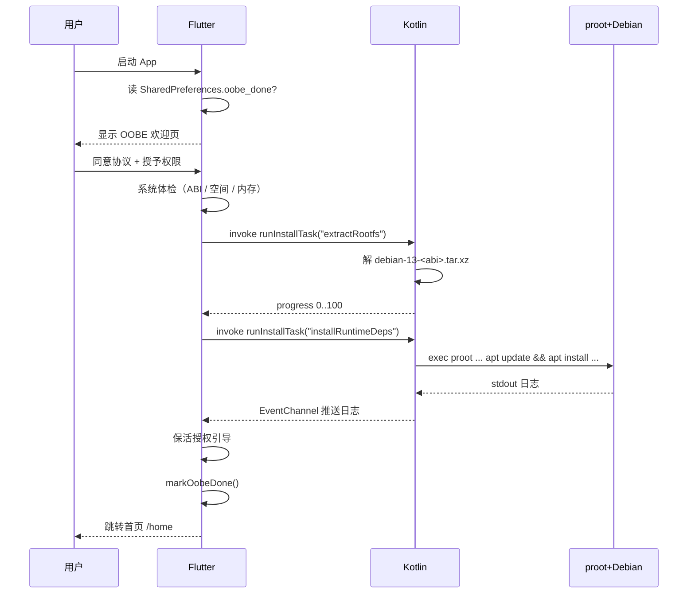
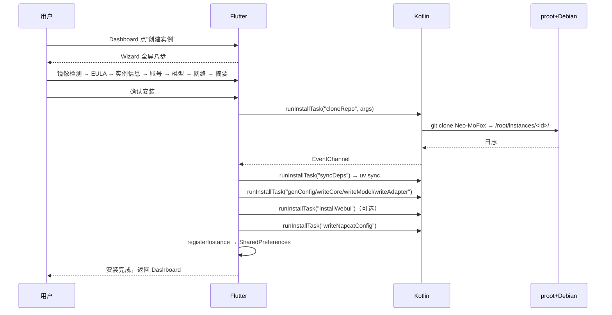
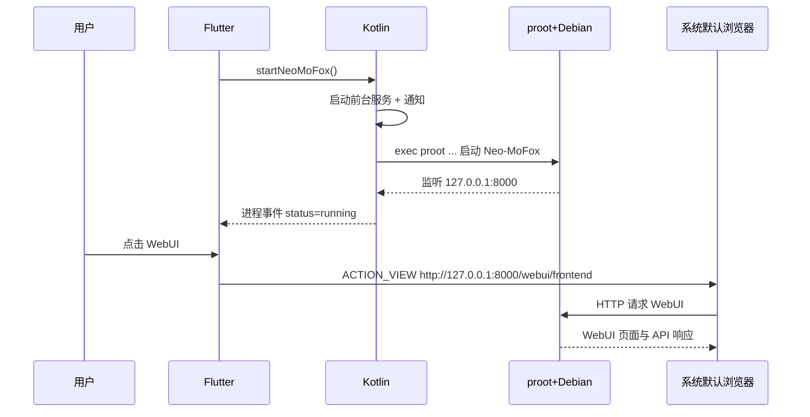
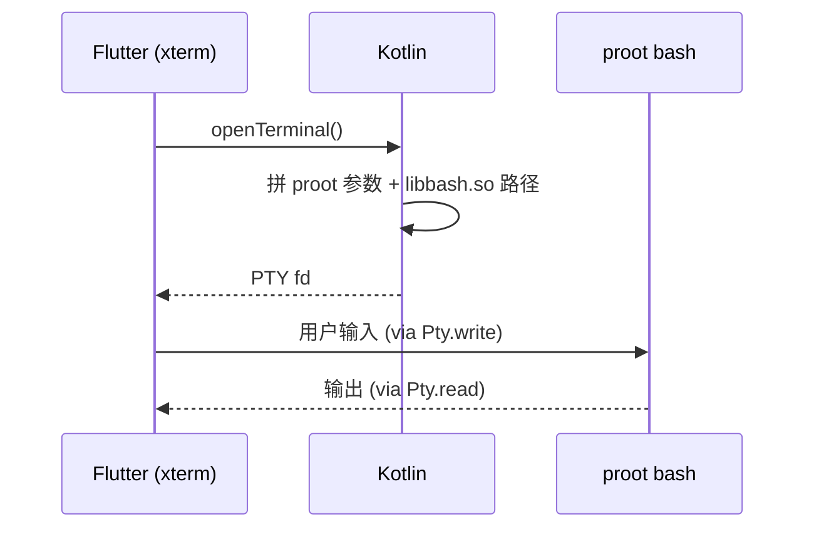

# MoFox-Android 架构总览

> 本文档是 MoFox-Android 安卓壳的**单一真实来源**。任何对运行时方案、UI 结构、技术栈或目录约定的改动，都必须先更新本文档再落代码。
>
> 最后同步：2026-07-17。

---

## 1. 项目定位

MoFox-Android 是 [Neo-MoFox](https://github.com/MoFox-Studio/Neo-MoFox) 的安卓原生外壳：

- **主界面**：Flutter 原生管理界面；Neo-MoFox WebUI 与 NapCat WebUI 通过系统默认浏览器访问。
- **原生层**：Kotlin 负责 OOBE、内嵌 Linux 运行时、终端、保活、系统级设置。
- **运行时**：通过 `jniLibs` 投放原生二进制 + `proot` rootless 容器 + **Debian 13 (trixie)** rootfs，跑 Neo-MoFox 主程序与 NapCat。

**不依赖 Termux**，App 自带完整运行时，安装即可用。

---

## 2. 设计目标

| 目标 | 说明 |
| --- | --- |
| **零外部依赖** | 不需要安装 Termux 或任何辅助 App，APK 自带所有原生二进制与 rootfs。 |
| **包名无关** | 原生二进制通过 `jniLibs` 由 Android 解包，路径可执行（W^X 友好），与 `applicationId` 解耦。 |
| **真发行版** | 内嵌完整 Debian 13 (trixie) rootfs，可直接 `apt install`，与桌面端开发体验一致。GNU coreutils 单文件分发，避开 util-linux 的 `/proc/self/exe` 自分派陷阱（与 proot loader 注入冲突，会触发 `unknown program 'libloader'`）。 |
| **WebUI 复用** | App 只负责启动服务并把本机 URL 交给系统浏览器，避免维护内置 WebView 与第二套管理界面。 |
| **保活** | 前台服务 + 通知 + （可选）自启，最大化降低后台被杀概率。 |
| **可测试** | OOBE / 运行时 / 外部浏览器跳转 / 终端均可独立验证。 |

---

## 3. 技术栈

| 层 | 技术 | 备注 |
| --- | --- | --- |
| UI 框架 | **Flutter 3.22+** / Dart 3.4+ | Material 3 + Android 12+ Dynamic Color |
| 状态管理 | **Riverpod 2 (Notifier / AsyncNotifier)** | OOBE 向导、实例、进程与设置状态 |
| 路由 | **go_router** | 四 Tab：首页 / 管理 / 终端 / 设置（ShellRoute + 底栏 / 侧栏自适应） |
| 终端 | **xterm.dart + NativePty (JNI)** | Dart 经 Method/EventChannel 控制 Kotlin PTY，会话连接到 proot 内 bash |
| 内嵌运行时 | **jniLibs 原生二进制 + proot + Debian 13 (trixie) rootfs** | 详见 §5.3 |
| 原生桥接 | **MethodChannel + EventChannel** | `mofox/runtime` / `mofox/runtime/events` / `mofox/platform` |
| 持久化 | `shared_preferences` + `flutter_secure_storage` | OOBE 状态、实例列表、Token |
| WebUI 入口 | `url_launcher`（`LaunchMode.externalApplication`） | 将 Neo-MoFox / NapCat 本机 URL 交给系统默认浏览器 |
| 保活 | Android 原生 `MoFoxForegroundService` | 前台服务 + 常驻通知 + 开机广播 |
| 归档 | `archive ^4.0.7` | 实例备份 ZIP 编解码与导入校验 |
| 网络下载 | `dio` | 离线包 / 镜像下载 / EULA 拉取 |
| 权限 | `permission_handler` | 通知 / 存储 / 自启 |
| 日志 | `logger ^2.3.0` + `share_plus ^10.0.0` | 双路输出（控制台 + 文件），支持导出分享 |
| 二维码 | `qr_flutter` | NapCat 扫码登录 |
| 构建 | Gradle 8 + AGP 8 + Kotlin 1.9 | targetSdk **35**, minSdk 24 |

---

## 4. 整体架构

```
┌─────────────────────────────────────────────────────────────┐
│                    Flutter (Dart) UI 层                      │
│  ┌───────────┐  ┌───────────┐  ┌───────────┐  ┌──────────┐   │
│  │  OOBE     │  │  Home     │  │ Dashboard │  │ Terminal │   │
│  │  Wizard   │  │  (首页)    │  │  (管理)    │  │  (xterm) │   │
│  └─────┬─────┘  └─────┬─────┘  └─────┬─────┘  └────┬─────┘   │
│        │              │              │              │         │
│  ┌─────┴─────┐  ┌─────┴─────┐  ┌─────┴─────┐               │
│  │ Browser   │  │ Instance  │  │ Settings  │               │
│  │ Launcher  │  │  Detail   │  │ (外观/保活) │               │
│  └─────┬─────┘  └─────┬─────┘  └─────┬─────┘               │
│        └──────────────┴──────────────┘                      │
│                       │                                     │
│         Riverpod Notifier / AsyncNotifier                   │
│  ┌──────────────────────────────────────────────────────┐   │
│  │  core/utils/app_logger  core/ui/ansi_color_text      │   │
│  │  core/runtime/runtime_bridge  core/platform          │   │
│  └──────────────────────────────────────────────────────┘   │
└───────────────────────┼─────────────────────────────────────┘
                        │ MethodChannel / EventChannel
┌───────────────────────┼─────────────────────────────────────┐
│              Kotlin (Android 原生) 运行时层                  │
│                                                             │
│  RuntimeBridgePlugin          PlatformGatewayPlugin         │
│   ├── isBootstrapped()        ├── exportToSaf()             │
│   ├── runInstallTask()        ├── openVendorAutostart()     │
│   ├── startProcess()          ├── requestIgnoreBattery…()   │
│   ├── openShell()             ├── startForegroundService()  │
│   └── streamLogs()            └── getKeepaliveStatus()      │
│                                                             │
│  RootfsInstaller  RuntimeCommandBuilder  RuntimeProcessManager│
│  NativePty  RuntimeScripts  MoFoxForegroundService          │
│  BootCompletedReceiver                                      │
└───────────────────────┼─────────────────────────────────────┘
                        │ exec
┌───────────────────────┼─────────────────────────────────────┐
│      jniLibs (Android 解包到 nativeLibraryDir，可执行)      │
│   libmofoxpty.so  libbash.so  libbusybox.so  libproot.so    │
│   libsudo.so  libloader.so   liblibtalloc.so.2.so           │
└───────────────────────┼─────────────────────────────────────┘
                        │ proot -0 -r <rootfs>
┌───────────────────────┼─────────────────────────────────────┐
│         Debian 13 (trixie) rootfs (内嵌 .tar.xz)            │
│   /usr/bin/apt   /usr/bin/python3   /root/instances/<id>/…  │
│   NapCat (全局)  uv venv   sqlite3                           │
└─────────────────────────────────────────────────────────────┘
```

WebUI 不在 Flutter 组件树内渲染。实例详情页使用 `url_launcher` 发出 Android
`ACTION_VIEW`，由系统默认浏览器访问 rootfs 内监听在回环地址上的服务。

---

## 5. 关键模块详解

### 5.1 OOBE 一次性引导（`app/lib/features/oobe/`）

首启一次性引导（Riverpod `OobeFlowNotifier`），四步：

1. **欢迎与隐私同意**（`welcome_step`）：展示品牌、协议（AGPL-3.0）、隐私政策、EULA，用户点击"同意并继续"。
2. **系统体检**（`system_check_step`）：当前为 UI 占位检查，展示 arm64-v8a、磁盘、内存和 Android API 要求；尚未接入 `RuntimeBridge.probe()`，不能作为真实硬件检测结果。
3. **解压运行时**（`extract_runtime_step`）：解压 Debian 13 (trixie) rootfs、首次启动 proot、`apt update && apt install` 基础工具链，并安装全局 NapCat。最后单独执行 NapCat 完整性复查（QQ 可执行文件、`napcat.mjs`、启动加载器、`package.json` 注入、`xvfb-run` 与 MoFox 启动脚本）；任一项缺失均以非 0 退出码中止 OOBE。自动开跑，失败可重试。日志用 `AnsiColorText` 彩色渲染。
4. **保活授权引导**（`keepalive_step`）：通知权限、忽略电池优化、厂商自启动引导。

完成后写 `SharedPreferences.oobe_done = true`，路由 redirect 自动跳到 `/home`。

> **OOBE ≠ Wizard**：OOBE 只做全局一次性的事情（rootfs 解压、apt 依赖、NapCat 安装与复查、保活授权）。创建 Bot 实例走 §5.2 的 Wizard，可反复创建多个实例。

### 5.2 实例创建向导（`app/lib/features/wizard/`）

从 Dashboard "创建实例" 入口进入，全屏八步（Riverpod `WizardNotifier`）：

1. **镜像源检测**（`mirror_check_step`）：探测 GitHub / GHProxy / Gitee 三个镜像源延迟，自动选最快。
2. **用户协议**（`eula_step`）：从所选镜像源拉取 EULA 文本（dio），用户勾选同意。
3. **实例信息**（`instance_info_step`）：实例名称。
4. **账号配置**（`account_step`）：Bot QQ + 昵称 + 主人 QQ。
5. **模型配置**（`model_step`）：API Base URL + API Key。
6. **网络配置**（`network_step`）：WebSocket 端口 + 更新通道（main/dev）+ WebUI 开关与密钥。
7. **确认摘要**（`summary_step`）：汇总所有配置，可跳回修改。
8. **安装执行**（`install_step`）：跑 9 个 `InstallTask`，日志用 `AnsiColorText` 彩色渲染，支持展开/折叠、失败续装。

安装任务（每个实例独占，路径前缀 `/root/instances/<id>/`）：

| InstallTask | 说明 |
| --- | --- |
| `cloneRepo` | 从所选镜像源 git clone Neo-MoFox |
| `syncDeps` | `uv sync` 同步 Python 依赖 |
| `genConfig` | 生成默认 toml |
| `writeCore` | 写入 core.toml |
| `writeModel` | 写入 model.toml |
| `writeAdapter` | 写入 adapter.toml |
| `installWebui` | 安装 WebUI（可跳过） |
| `writeNapcatConfig` | 写入 onebot11 配置 |
| `registerInstance` | 写实例到本地仓库 |

每步使用 Riverpod `Notifier` 暴露 `WizardState`：

```dart
class WizardState {
  final WizardStep step;
  final InstanceDraft draft;
  final Map<InstallTask, InstallTaskStatus> taskStatus;
  final double taskProgress;
  final List<String> logs;
  final String? errorMessage;
  final String? napcatQrPayload;
  final bool installFinished;
  final bool installStarted;
  final bool resumeAvailable;  // 失败后允许从断点续装
  final String? instanceId;
  final String? installDir;
}
```

错误格式化：捕获 `PlatformException` 时拼接 `"$msg ($code)"`，避免静默挂起。失败后实例保留在 Dashboard，可点"继续安装"从断点恢复（`prepareResume` + `startInstall(resume: true)`）。

### 5.3 主界面壳与导航（`app/lib/features/shell/` + `app/lib/app/router/`）

- **ShellPage**：`ShellRoute` 的容器，底部 `NavigationBar`（< 600 dp）或侧边 `NavigationRail`（≥ 600 dp）自适应。四 Tab：首页 → 管理 → 终端 → 设置。
- **路由**（`app_router.dart`）：`GoRouter` + `redirect` 守卫。OOBE 未完成时强制跳 `/oobe`；已完成时从 `/oobe` 跳 `/home`。Wizard（`/wizard`）和实例详情（`/dashboard/instance`）是全屏路由，不挂在 ShellRoute 下。
- **路由表**：

| 路径 | 页面 | 说明 |
| --- | --- | --- |
| `/oobe` | `OobePage` | 一次性引导 |
| `/wizard` | `WizardPage` | 实例创建向导（全屏） |
| `/home` | `HomePage` | 首页：系统概览 + 主图 |
| `/dashboard` | `DashboardPage` | 管理：实例卡片网格 |
| `/dashboard/instance` | `InstanceDetailPage` | 实例详情（全屏） |
| `/terminal` | `TerminalPage` | 终端 |
| `/settings` | `SettingsPage` | 设置 |
| `/settings/appearance` | `AppearancePage` | 外观与主题 |
| `/settings/keepalive` | `KeepaliveStatusPage` | 保活体检 |
| `/settings/backup` | `BackupPage` | 实例备份导入与导出 |
| `/settings/about` | `AboutPage` | 关于 |
| `/settings/about/licenses` | `ThirdPartyLicensesPage` | 第三方库许可 |

### 5.4 内嵌运行时（`app/android/app/src/main/kotlin/com/mofox/android/runtime/`）

#### 5.4.1 jniLibs 二进制投放

Android 在安装时把 `src/main/jniLibs/<abi>/lib*.so` 解包到 `applicationInfo.nativeLibraryDir`（典型路径：`/data/app/~~xxx==/com.mofox.android-yyy==/lib/arm64`）。**该目录是少数 W^X 默认豁免的可执行路径之一**，绕过 SELinux 对 `/data/data/<pkg>/files/**` 的禁止执行限制。

利用这点，把所有原生二进制伪装成 `.so` 投递：

| jniLibs 文件名 | 实际作用 |
| --- | --- |
| `libmofoxpty.so`        | JNI PTY 桥接，供 `NativePty` 创建和控制终端会话 |
| `libbash.so`            | bash 解释器 |
| `libbusybox.so`         | BusyBox 工具集（`mkdir/cp/ln/...`） |
| `libproot.so`           | proot rootless 容器 |
| `libsudo.so`            | proot 内的 sudo 替身（**严禁 strip**） |
| `libloader.so`          | proot 的 ELF loader（`PROOT_LOADER`） |
| `liblibtalloc.so.2.so`  | proot 依赖的 talloc.so.2，**双 lib 前缀**让 Android 仍按 jniLibs 解包 |

`build.gradle.kts` 关键配置：

```kotlin
android {
    defaultConfig {
        targetSdk = 35
        minSdk = 24
        ndk {
            abiFilters += listOf("arm64-v8a")
        }
    }
    packaging {
        jniLibs {
            useLegacyPackaging = true   // = AndroidManifest extractNativeLibs="true"
            keepDebugSymbols += listOf("**/libmofoxpty.so", "**/lib*.so")
        }
    }
}
```

`AndroidManifest.xml`：

```xml
<application
    android:extractNativeLibs="true"
    ... >
```

#### 5.4.2 rootfs 安装（`RootfsInstaller.kt`）

启动时通过 `usr/bin/env` 与 `etc/os-release` 判断 `filesDir/usr/var/lib/proot-distro/installed-rootfs/ubuntu` 是否已引导（路径中的 `ubuntu` 是历史命名，实际是 Debian 13 rootfs）：

1. `RootfsInstaller` 把 `assets/rootfs/debian-13-arm64.tar.xz` 和运行时脚本复制到 App 私有目录。
2. `RuntimeScripts` 调用随 APK 投放的 BusyBox `tar xJf` 解包到 rootfs；Kotlin 层不自行解析 tar.xz。
3. 解包后以 rootfs 内关键文件存在作为引导完成条件，后续启动直接复用现有 rootfs。
4. 当前 APK 只构建 `arm64-v8a`；NapCat 依赖的 Node.js 不支持本项目原先考虑的 32 位 ARM 方案。

> **rootfs 来源**：[LXC images](https://images.linuxcontainers.org/) 的 `debian/trixie/<arch>/default/` 每日构建，文件已经是 `rootfs.tar.xz` 不需要重压。`python tools/build.py --fetch-rootfs` 会自动列目录抓最新时间戳并下载，按优先级走清华 → BFSU → 上游官方三个镜像。下载产物按 `debian-13-<arm64|armhf|amd64>.tar.xz` 命名落到 `app/assets/rootfs/`。codename `trixie` 写死在 `RuntimeScripts.UBUNTU_CODENAME`。
>
> **为什么不用 Ubuntu**：Ubuntu 24.04+ 的 coreutils 是 util-linux 风格的多调用单 ELF（通过 `/proc/self/exe` 解析 argv[0] 来分派子命令），proot 的 loader 注入会让 `/proc/self/exe` 指向 `libloader.so`，触发 `coreutils: unknown program 'libloader'`。Debian 仍然走 GNU coreutils 单工具单 ELF 的传统路线，与 proot 兼容。
>
> **apt 镜像**：默认指向华为云 `mirrors.huaweicloud.com/debian/` 与 `mirrors.huaweicloud.com/debian-security/`，配置 `main contrib non-free non-free-firmware` 全套组件，写死在 `RuntimeScripts.changeUbuntuSourceFn` 中，OOBE 第 3 步执行。

#### 5.4.3 proot 命令拼装（`RuntimeCommandBuilder.kt`）

不使用 `proot-distro`，直接调用 `proot`：

```bash
NATIVE=$applicationInfo.nativeLibraryDir
ROOTFS=$filesDir/usr/var/lib/proot-distro/installed-rootfs/ubuntu
TMPDIR=$cacheDir/tmp

PROOT_LOADER="$NATIVE/libloader.so" \
LD_LIBRARY_PATH="$NATIVE" \
PROOT_TMP_DIR="$TMPDIR" \
exec "$NATIVE/libproot.so" \
    -0 -r "$ROOTFS" --link2symlink \
    -b /dev -b /proc -b /sys -b /dev/pts \
    -b "$TMPDIR":"$TMPDIR" -b "$TMPDIR":/dev/shm \
    -b /proc/self/fd:/dev/fd \
    -b /storage/emulated/0:/sdcard \
    $FAKE_PROC_BINDS \
    -w /root \
    /usr/bin/env -i \
        HOME=/root \
        TERM=xterm-256color \
        LANG=en_US.UTF-8 \
        TZ="$ANDROID_TZ" \
        PATH=/usr/local/sbin:/usr/local/bin:/usr/sbin:/usr/bin:/sbin:/bin \
        "$NATIVE/libbash.so" -lc "$USER_SCRIPT"
```

要点：

- `-0`：把当前 uid 映射为 root（rootless 假 root）。
- `-r`：根切到 rootfs。
- `--link2symlink`：把硬链接转为软链接（rootfs 内 apt 大量用硬链接，但 Android `/data` 不允许跨设备硬链接）。
- `-b`：bind mount，关键的有 `/dev`、`/proc`、`/sys`、`/dev/pts`，以及把 Android 的 sdcard 映射到 `/sdcard`。
- `PROOT_LOADER` / `LD_LIBRARY_PATH` / `PROOT_TMP_DIR` 必须显式设置，否则 proot 找不到自己的 loader。
- `env -i` 清空环境再注入白名单，避免 Android 环境变量污染。
- 调用 `libbash.so` 而不是 rootfs 内的 `/bin/bash`，因为容器还没进去之前需要先有 shell 来 exec proot。

#### 5.4.4 假 /proc 数据（`setup_fake_sysdata`）

部分 Android 设备禁止读 `/proc/loadavg` `/proc/stat` `/proc/version`。运行时在 rootfs 启动前：

1. 写假数据到 `filesDir/fake_proc/{loadavg,stat,version,...}`。
2. 仅当宿主对应文件**不可读**时，追加 `-b $fake/loadavg:/proc/loadavg` 等 bind mount。
3. 否则不绑（保留宿主真实数据）。

#### 5.4.5 进程管理（`RuntimeProcessManager.kt`）

- 通过 `ProcessBuilder` 起 proot，`stdout/stderr` redirect 到 PTY 或日志管道。
- 通过原生 `MoFoxForegroundService` 维持前台服务和通知，并由 `BootCompletedReceiver` 处理开机及应用升级后的恢复入口。
- 子进程退出时：
  - 正常退出 → 标记 `Stopped`，UI 弹出"已停止"。
  - 异常退出（return code != 0） → 收集最后 200 行日志，发到 EventChannel，UI 显示崩溃面板。
- 重启策略：用户手动触发，**不**自动重启避免日志风暴。

### 5.5 终端（`app/lib/features/terminal/`）

- xterm.dart 渲染；Kotlin `NativePty` 通过 `libmofoxpty.so` 创建 PTY，Dart 使用 `RuntimeBridge.openShell/writeShell/resizeShell/closeShell` 控制会话。
- PTY 子进程沿用 §5.4.3 的 proot 命令拼装，并通过 EventChannel 把输出流推送给 `TerminalSession`。
- 终端是独立 PTY，与 §5.4.5 主 Neo-MoFox 进程**不共享**。用户可以在终端里 `apt install`、`htop`、`tmux a`，主进程不受影响。
- **彩色主题**：`TerminalTheme` 固定深色背景（`#1A1B26`）+ 标准 16 色 ANSI 调色板，不受 Flutter 亮色主题影响。
- **.bashrc 注入**：启动时注入 `export TERM=xterm-256color` + 彩色 prompt + 常用 alias（`ls --color=auto`、`grep --color=auto` 等），让终端开箱即彩色。
- **文本选择**：保留 xterm 的字符网格选区；两个 Material 选择手柄覆盖在终端上并映射到 cell anchor，Android 自适应悬浮菜单提供复制/全选。工具栏不占布局高度，选择时不会触发 PTY resize 或文本回流。
- **复制**：直接调用 `terminal.buffer.getText(selection)`，由 xterm 处理真实换行、自动折行和宽字符。
- **触感反馈**：长按选择、手柄拖动结束、复制和快捷键按钮震动，可在设置中开关。
- **多入口**：首页顶部"打开终端"（`cwd=/root`）、实例卡片"在 bot 目录开终端"（`cwd=instance.repoPath`）、实例卡片"在实例根目录开终端"（`cwd=instance.installDir`）。

### 5.6 首页（`app/lib/features/home/`）

- 系统概览卡片：CPU、内存、存储使用率，通过 `systemStatsProvider`（5 秒轮询 `RuntimeBridge.systemStats()`）。
- **主图模式**（`MainImageMode`）：沉浸主图 / 紧凑主图 / 隐藏，由外观设置控制。沉浸模式展示更醒目的主题视觉，紧凑模式减少占用，隐藏模式只保留数据卡片。
- 顶部操作栏：打开终端、刷新。

### 5.7 管理页与实例详情（`app/lib/features/dashboard/` + `app/lib/features/instance/`）

- **DashboardPage**：实例卡片网格 + "创建实例" FAB。空态引导用户创建第一个实例。
- **InstanceDetailPage**：实例详情全屏页，双 Tab（控制台 + 日志）：
  - 控制台 Tab：Bot/NapCat 进程启停按钮、状态指示灯、NapCat 扫码登录弹窗（`NapcatQrSheet`），以及 WebUI 外部浏览器入口。
  - 日志 Tab：Bot 日志 + NapCat 日志，用 `AnsiColorText` 彩色渲染。
- **WebUI 按钮**：Neo-MoFox 固定打开 `http://127.0.0.1:8000/webui/frontend`；NapCat 使用进程日志解析出的带 token URL。两者都明确使用 `LaunchMode.externalApplication`。
- **ProcessConsoleNotifier**：管理 bot/napcat 进程的启停、状态轮询（3 秒）、日志累积（最多 400 行）、NapCat 扫码登录与 WebUI URL 解析。
- **NapCat 二维码**：启动前同时清理兼容目录和 NapCat 实际缓存目录中的旧二维码；同一路径被覆盖时给 payload 附加刷新版本，并直接读取文件字节，避免显示 Flutter 图片缓存中的过期二维码。
- **InstanceRepository**：用 SharedPreferences 存 JSON 数组（`instances_v2`），支持 `add` / `upsert` / `remove` / `loadAll`。
- **Instance** 模型：id、name、botQq、botNickname、ownerQq、wsPort、channel、installNapcat、installWebui、installDir、createdAt、installStatus（installing/failed/installed）、lastInstallTask、installError。

### 5.8 设置（`app/lib/features/settings/`）

- **SettingsPage**：分组列表入口，包含外观、终端、运行时状态、保活体检、备份与导出、关于。
- **AppearancePage**（`/settings/appearance`）：
  - 主题模式（跟随系统 / 浅色 / 深色），`SegmentedButton` 切换。
  - 动态取色开关（Android 12+ Material You，从壁纸取色，回退品牌色）。
  - 主图模式（沉浸 / 紧凑 / 隐藏），`RadioListTile` 切换。
  - 实时预览卡片，展示当前主题效果。
- **KeepaliveStatusPage**（`/settings/keepalive`）：保活体检面板，展示通知权限、电池优化白名单、前台服务、开机自启声明、厂商自启动状态，每项可一键跳转授权。
- **AboutPage**（`/settings/about`）：版本号、源代码链接、AGPL-3.0 许可、第三方库许可入口。
- **ThirdPartyLicensesPage**（`/settings/about/licenses`）：Flutter `LicensePage`，自动列出所有依赖库的 LICENSE。
- **BackupPage**（`/settings/backup`）：通过 SAF 导出/导入 ZIP。完整备份包含实例 `config/`、NapCat 配置与登录态，可选包含日志；导入时校验 `manifest.json`、格式版本、文件数量与解压体积，并拒绝路径穿越、重复目标和未知目录。
- **AppSettings**：持久化到 SharedPreferences，包含 `themeMode`、`dynamicColorEnabled`、`mainImageMode`、`terminalHapticsEnabled`。

### 5.9 外部浏览器 WebUI

- 项目不包含 `features/webview/`、`WebViewPage`、`WebViewController` 或 `webview_flutter` 依赖。
- 实例详情页仅在对应进程运行时启用 WebUI 按钮。
- Neo-MoFox WebUI 使用固定回环地址 `http://127.0.0.1:8000/webui/frontend`。
- NapCat 启动日志中的 `WebUi User Panel Url` 会被解析到 `napcatWebuiUrl`；该 URL 自带 token，原样交给浏览器。
- 如果 NapCat URL 尚未就绪或系统无法处理 URL，应用使用 `SnackBar` 给出明确提示。
- 外部浏览器拥有独立的 Cookie、localStorage、返回栈和生命周期，App 不注入脚本、不缓存网页，也不持有网页内容。

### 5.10 日志系统（`app/lib/core/utils/app_logger.dart`）

全局日志器，只面向原生壳本身（Bot 业务日志在 WebUI 看）。

- **双路输出**：控制台（`PrettyPrinter` 带颜色）+ 文件（`<appDocDir>/logs/mofox_<date>.log`，追加模式）。
- **release 也输出**：自定义 `_MoFoxLogFilter` 覆盖默认的 `DevelopmentFilter`（默认 release 全屏蔽）。
- **日志调用点**：`main.dart`（启动、FlutterError、未捕获异步异常）、`WizardNotifier`（每步安装开始/失败/完成）、`OobeFlowNotifier`（运行时安装）、`ProcessConsoleNotifier`（进程启停、NapCat 登录）、`RuntimeBridge`（安装任务、进程操作、shell 操作）。
- **导出分享**：`currentLogFilePath()` 获取当天日志路径，`shareLogFile()` 用 `share_plus` 分享日志文件。
- **Provider**：`appLoggerProvider`（虽然当前直接用全局 `appLogger`，保留 provider 供后续依赖注入）。

### 5.11 ANSI 彩色文本（`app/lib/core/ui/ansi_color_text.dart`）

解析 ANSI SGR 转义序列并用 `TextSpan` 渲染彩色文本。

- **支持**：前景色 30-37 / 90-97（bright）、背景色 40-47 / 100-107、重置 0、粗体 1、暗淡 2、斜体 3、下划线 4、闪烁 5、反色 7、256 色 `38;5;<n>` / `48;5;<n>`、TrueColor `38;2;r;g;b` / `48;2;r;g;b`。
- **不支持**的序列静默忽略，只输出可见字符。
- **使用场景**：Wizard 安装日志、OOBE 解压日志、实例详情 Bot/NapCat 日志面板。
- **调色板**：标准 16 色 + 256 色扩展（6×6×6 RGB 立方体 + 24 级灰度），与终端 `TerminalTheme` 调色板一致。

### 5.12 平台网关（`app/lib/core/platform/platform_gateway.dart`）

与原生层的非 runtime 平台能力对话（MethodChannel `mofox/platform`）。

- `exportToSaf()`：通过 SAF 让用户选目录后落文件，返回 content URI。
- `openVendorAutostart()`：跳系统设置页（自启动 / 耗电管理 / 后台锁定），按厂商分发。
- `requestIgnoreBatteryOptimizations()`：请求加入电池优化白名单。
- `getKeepaliveStatus()`：拉取保活状态快照（通知权限、电池白名单、前台服务、开机广播、厂商自启动）。
- `startForegroundService()` / `stopForegroundService()`：前台服务开关。
- `setKeepScreenOn()`：保持屏幕常亮。

---

## 6. 关键流程

### 6.1 首启 OOBE



### 6.2 创建实例（Wizard）



### 6.3 主程序运行与 WebUI



### 6.4 终端会话



---

## 7. 目录结构

```
MoFox-Android/
├── ARCHITECTURE.md                    # 本文档
├── README.md                          # 快速上手
├── LICENSE                            # AGPL-3.0
├── eula.md / PRIVACY.md               # 许可与隐私
├── tools/
│   └── build.py                       # 构建脚本（pub get + build apk + 复制产物）
├── dist/                              # CI / 本地构建产物（不入仓）
└── app/
    ├── pubspec.yaml
    ├── analysis_options.yaml
    ├── lib/
    │   ├── main.dart                  # 入口：runZonedGuarded + 日志初始化
    │   ├── app/
    │   │   ├── mofox_app.dart         # MaterialApp.router + DynamicTheme
    │   │   └── router/app_router.dart # GoRouter + redirect 守卫
    │   ├── core/
    │   │   ├── platform/platform_gateway.dart  # MethodChannel mofox/platform
    │   │   ├── runtime/
    │   │   │   ├── runtime_bridge.dart         # MethodChannel mofox/runtime
    │   │   │   └── process_state.dart         # 进程三态机
    │   │   ├── theme/app_theme.dart            # Material 3 + 品牌色
    │   │   ├── ui/ansi_color_text.dart        # ANSI 彩色文本渲染
    │   │   └── utils/app_logger.dart          # 双路日志（控制台 + 文件）
    │   └── features/
    │       ├── oobe/                  # 一次性引导（4 步）
    │       │   ├── application/oobe_flow_notifier.dart
    │       │   ├── application/oobe_status_provider.dart
    │       │   ├── domain/oobe_step.dart
    │       │   └── presentation/
    │       │       ├── oobe_page.dart
    │       │       └── widgets/       # welcome / system_check / extract_runtime / keepalive
    │       ├── wizard/                # 实例创建向导（8 步）
    │       │   ├── application/wizard_notifier.dart
    │       │   ├── domain/wizard_step.dart
    │       │   ├── domain/wizard_mirror_source.dart
    │       │   └── presentation/
    │       │       ├── wizard_page.dart
    │       │       └── widgets/       # mirror_check / eula / instance_info / account / model / network / summary / install / napcat_qr_sheet
    │       ├── home/                  # 首页：系统概览 + 主图
    │       │   └── presentation/home_page.dart
    │       ├── dashboard/             # 管理页：实例卡片网格
    │       │   ├── application/process_console_provider.dart
    │       │   ├── application/system_stats_provider.dart
    │       │   ├── domain/system_stats.dart
    │       │   └── presentation/dashboard_page.dart
    │       ├── instance/              # 实例模型与仓储
    │       │   ├── application/instance_repository.dart
    │       │   ├── domain/instance.dart
    │       │   └── presentation/instance_detail_page.dart
    │       ├── shell/                 # 主界面壳：底栏 / 侧栏
    │       │   └── presentation/shell_page.dart
    │       ├── terminal/             # xterm + Kotlin/JNI NativePty
    │       │   ├── application/terminal_session_provider.dart
    │       │   └── presentation/terminal_page.dart
    │       ├── backup/               # 实例备份导入/导出与归档校验
    │       │   ├── application/backup_service.dart
    │       │   └── presentation/backup_page.dart
    │       └── settings/             # 设置
    │           ├── application/app_settings_provider.dart
    │           └── presentation/
    │               ├── settings_page.dart
    │               ├── appearance_page.dart
    │               ├── keepalive_status_page.dart
    │               ├── about_page.dart
    │               └── third_party_licenses_page.dart
    ├── assets/
    │   ├── icons/
    │   ├── legal/                     # eula.md / privacy.md
    │   ├── scripts/                   # 注入到 rootfs 的初始化脚本
    │   └── rootfs/
    │       └── debian-13-<abi>.tar.xz      # CI 拉取，不入仓
    ├── android/
    │   └── app/
    │       ├── build.gradle.kts
    │       ├── src/main/
    │       │   ├── AndroidManifest.xml
    │       │   ├── kotlin/com/mofox/android/
    │       │   │   ├── MainActivity.kt
    │       │   │   ├── platform/PlatformGatewayPlugin.kt
    │       │   │   ├── keepalive/
    │       │   │   │   ├── MoFoxForegroundService.kt
    │       │   │   │   └── BootCompletedReceiver.kt
    │       │   │   └── runtime/
    │       │   │       ├── RuntimeBridgePlugin.kt
    │       │   │       ├── RootfsInstaller.kt
    │       │   │       ├── RuntimeCommandBuilder.kt
    │       │   │       ├── RuntimeProcessManager.kt
    │       │   │       ├── RuntimeScripts.kt
    │       │   │       └── NativePty.kt
    │       │   └── jniLibs/                   # CI 拉取，不入仓
    │       │       └── arm64-v8a/
    │       │           ├── libmofoxpty.so
    │       │           ├── libbash.so
    │       │           ├── libbusybox.so
    │       │           ├── libproot.so
    │       │           ├── libsudo.so
    │       │           ├── libloader.so
    │       │           └── liblibtalloc.so.2.so
    │       └── proguard-rules.pro
    └── test/
        ├── widget_test.dart
        └── features/
```

---

## 8. 主题与设计

### 8.1 品牌色

| Token | Hex | 用途 |
| --- | --- | --- |
| `brand.primary`   | `#367BF0` | 主按钮、强调、Tab 激活态 |
| `brand.accent`    | `#82B0FA` | 渐变结束、次级强调 |
| `brand.gradient`  | `linear(0deg, #367BF0, #82B0FA)` | 启动页、欢迎页大块背景 |

### 8.2 Material 3

- `useMaterial3: true`。
- Android 12+ 启用 `dynamic_color`，从壁纸取色，回退到品牌色。
- 暗色模式自动从亮色模式 ColorScheme 派生。

### 8.3 四 Tab 主界面

| Tab | 入口 | 内容 |
| --- | --- | --- |
| 首页 | `/home` | 系统概览（CPU/内存/存储）+ 主图（沉浸/紧凑/隐藏） |
| 管理 | `/dashboard` | 实例卡片网格 + 创建实例 FAB + 实例详情 |
| 终端 | `/terminal` | xterm.dart 直连 Debian bash，彩色主题 |
| 设置 | `/settings` | 外观、终端、运行时状态、保活体检、备份导出、关于 |

底部 `NavigationBar`（< 600 dp）或侧边 `NavigationRail`（≥ 600 dp），**不**做侧栏菜单（手机优先）。

---

## 9. 安全与隐私

- **AGPL-3.0**：与 Neo-MoFox 主程序保持一致，闭源分发须开放完整源码。
- **不上报**：App 默认零遥测、零崩溃上报。本地崩溃日志写入 `<appDocDir>/logs/mofox_<date>.log`，用户可在设置中主动导出分享。
- **Token 存储**：登录态 / Neo-MoFox API Token 存 `flutter_secure_storage`（AndroidKeystore）。
- **浏览器边界**：应用不嵌入网页、不注入 JavaScript，也不读取浏览器 Cookie/localStorage；WebUI 会话由用户选择的默认浏览器管理。
- **网络**：外网请求必须走 HTTPS；本机 WebUI 使用回环地址上的 HTTP。`AndroidManifest` 当前启用 `usesCleartextTraffic=true`，运行时服务必须只绑定 `127.0.0.1`，不得暴露到局域网接口。
- **proot rootless**：不需要 root 权限，所有"root"都是 proot 假装的。
- **rootfs 完整性**：解压后写 `version.txt` + SHA-256，启动时校验。

---

## 10. 测试策略

| 层 | 工具 | 范围 |
| --- | --- | --- |
| 单元 | `flutter_test` | Notifier 状态机、命令拼装、错误格式化 |
| Widget | `flutter_test` | 向导每一步、设置面板、终端壳 |
| 集成 | `integration_test` | 真机 / 模拟器跑完整 OOBE、实例安装与外部浏览器 intent |
| Kotlin | JUnit + Robolectric | RootfsInstaller、CommandBuilder、FakeProcSysdata |
| 端到端 | 手动 + GitHub Actions Macrobenchmark（后续） | 冷启动 / OOBE 总耗时 / WebUI 浏览器跳转 |

CI 阶段：

- PR：`flutter analyze --no-fatal-infos` + `flutter test`，**不**构建 APK，**不**下 rootfs。
- Push：当前支持 `arm64-v8a`，下载对应 `libxxx.so` + `debian-13-arm64.tar.xz`，构建 debug APK 上传 artifact。
- Nightly：每天 02:00 BJT 构建 `arm64-v8a` debug APK；手动触发可选 debug / release；定时和手动构建都会重建并发布到 `nightly` 预发布 tag。

---

## 11. 风险与权衡

| 风险 | 缓解 |
| --- | --- |
| **proot 性能损失** | proot 在系统调用上有 30%~50% 的开销。Neo-MoFox 主要 IO bound，影响有限；NapCat 启动慢一次性。终端纯 IO，体感无差异。 |
| **APK 体积** | 当前只支持 `arm64-v8a`；jniLibs + rootfs 进入单架构包，后续扩展 ABI 时再按 ABI 分包。 |
| **Debian 13 trixie 周期** | trixie 已于 2025-08 正式发布稳定版，LTS 至 2030（普通安全维护），Freexian ELTS 可延至 2033。LXC 上游每天 rebuild，`tools/build.py --fetch-rootfs` 自动拉最新时间戳。**架构上无需任何改动，仅替换 rootfs 产物。** |
| **SELinux W^X 加严** | targetSdk≥28 默认禁止 `/data/data/<pkg>/files/**` 执行；使用 `nativeLibraryDir` 规避。未来 Android 版本若加严 jniLibs 也禁止执行，需要切到 `app_process` + `dex2oat` 思路。 |
| **rootfs 升级** | 用户已经在 rootfs 内 `apt install` 装了一堆软件，App 升级时不能直接覆盖。策略：**rootfs 版本号不变就不动**；版本号变更时引导用户备份 `/root` + 重新解压。 |
| **设备 /proc 限制** | OnePlus / 小米等设备禁读 `/proc/loadavg`。`FakeProcSysdata` 检测后用 bind mount 假数据兜底。 |
| **NapCat 网络敏感** | NapCat 安装走 GitHub 原始链接，国内可能慢。OOBE 内置 4 个 GitHub 加速代理，按延迟自动选最快。 |
| **默认浏览器不可用或被禁用** | `launchUrl(..., mode: externalApplication)` 返回失败时显示提示；不回退到内置 WebView。 |
| **保活仍可能被杀** | 国产 ROM 后台限制极激进。文档明确告诉用户开"自启"+"电池白名单"，并提供一键跳转。**承诺尽力而为，不保证 100%。** |

---

## 12. 路线图

- **v0.1（MVP）**
  - [x] OOBE 一次性引导（4 步：欢迎 → 体检 → 解压 rootfs → 保活）
  - [x] Wizard 实例创建向导（8 步：镜像 → EULA → 信息 → 账号 → 模型 → 网络 → 摘要 → 安装）
  - [x] jniLibs + Debian 13 rootfs 解压
  - [x] proot 命令拼装与首次启动
  - [x] 首页（系统概览 + 主图模式）+ 管理（实例卡片）+ 终端 + 设置
  - [x] 前台服务保活
  - [x] arm64-v8a CI 构建
  - [x] 彩色终端（xterm 主题 + .bashrc 注入）
  - [x] ANSI 彩色日志渲染（AnsiColorText）
  - [x] App 级日志系统（双路输出 + 导出分享）
- **v0.2**
  - [x] 外观设置页（主题模式 / 动态取色 / 主图模式）
  - [x] 保活体检页
  - [x] 关于页 + 第三方库许可页
  - [ ] 镜像源一键切换（apt 源）
  - [ ] 崩溃日志导出（设置页入口）
- **v0.3**
  - [x] 实例备份导入与导出（归档校验 + 路径穿越防护）
  - [ ] 多账号
  - [ ] 插件管理（套 Neo-MoFox 的插件 API）
- **v1.0**
  - [ ] Macrobenchmark 性能基线
  - [ ] 国际化（en、zh-Hant）
  - [ ] Play Store / 三方应用市场上架

---

## 13. 文档维护

- 任何技术栈、目录、模块、风险变更，**先改本文档**，再开 PR 改代码。
- README.md 仅放快速上手；细节一律链回本文档。
- 章节顺序与编号稳定，新增内容追加到末尾或对应章节内部。
- Mermaid 图保持可在 GitHub 渲染，避免使用插件特性。
- 所有路径用相对路径，避免硬编码 `G:\` 这类本地盘符。
