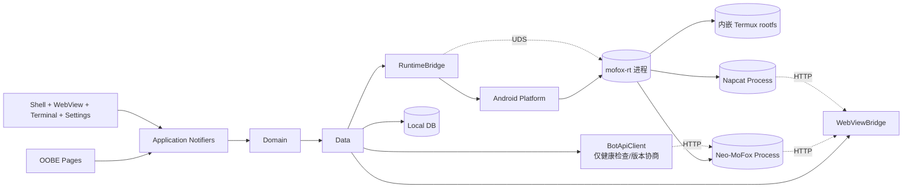
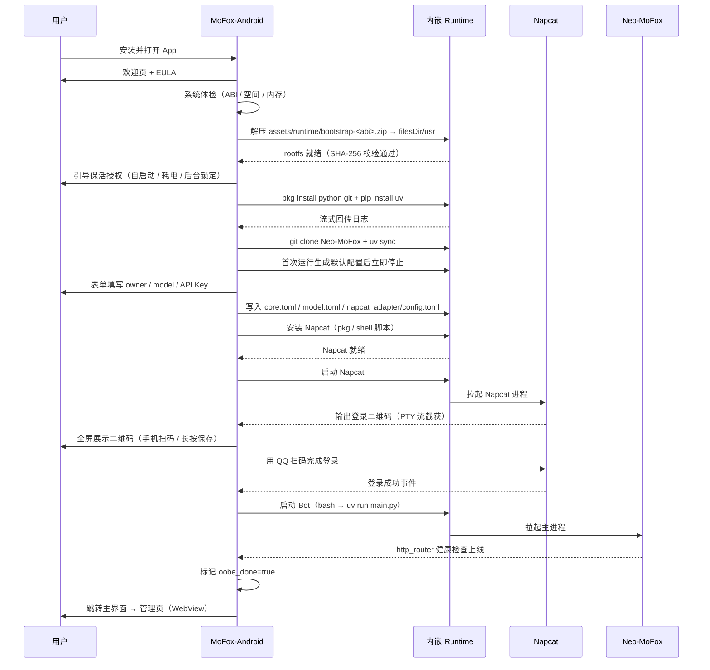
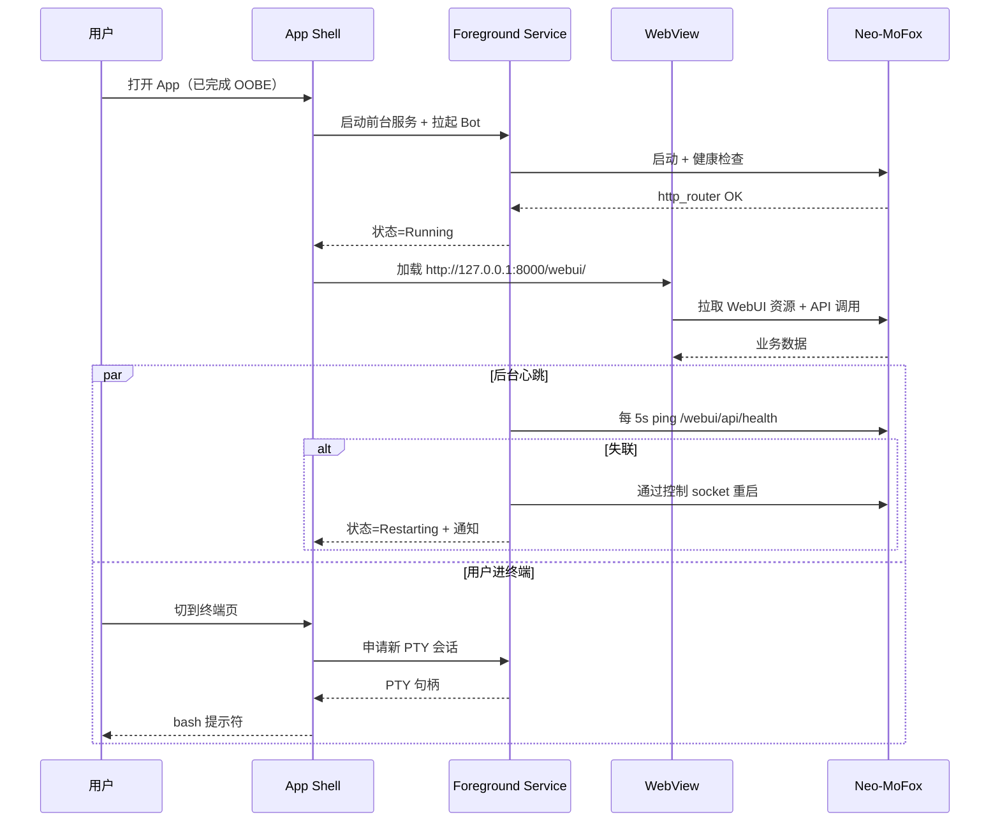

# MoFox-Android 架构文档

> Neo-MoFox 的安卓原生外壳 App。**WebView 套自家 WebUI** 做主界面，原生层只负责 OOBE、内嵌 Termux 运行时、终端、保活与系统级设置。Flutter + Material Design 3，品牌蓝主色（`#367BF0`/`#82B0FA`）。

---

## 1. 文档定位

本文档是 `MoFox-Android` 项目的架构总览，回答四个问题：

1. **它是什么** —— 一个安装即用的 Neo-MoFox 安卓管家：装好 → 跑 OOBE → 主界面用 WebView 打开 WebUI。
2. **它由哪些模块组成** —— 严格分层 + 功能切片，原生 UI 故意做得很薄。
3. **模块之间如何协作** —— 关键数据流与控制流。
4. **它怎么扩展** —— 新功能默认走 WebUI，原生壳只接「WebView 装不下」的事。

参考实现：仓库内 `MoFox-Bot-Docs/` 已经详细描述了 Neo-MoFox 主程序的部署与运行机制，本 App 不重新发明它的部署链路，而是把链路封装进 GUI；管理 UI 也直接复用 WebUI，不再原生重写一遍。

---

## 2. 设计目标与非目标

### 2.1 目标

- **零命令行、零外部依赖**：从安装 APK 到 Bot 上线，全程图形化，**用户不需要装 Termux 或 ZeroTermux**。
- **管理界面用现成的**：Neo-MoFox / Napcat 两套 WebUI 都通过 WebView 直接套用，不在 App 里重复造表单。
- **守得住后台**：默认前台服务 + 引导用户开启系统级保活，掉线即告警。
- **首次安装有 OOBE**：把过去散落在文档里的步骤压成一条引导流，让小白能跑完。
- **三大主菜单**：UI 页（WebView，可在 Napcat / Neo-MoFox 之间切换）、终端页（PTY）、设置页（系统级 / 导出 / 关于）。
- **模块化、可演进**：业务逻辑切片清晰，原生与 Web 之间用清晰契约连接。
- **用户数据自持**：所有 Bot 数据落在用户设备上，App 不上传任何用户内容。

### 2.2 非目标

- **不是 Neo-MoFox 的替代实现**。Bot 主体仍由 Python 进程在内嵌运行时中跑，App 只做包装。
- **不重写 WebUI**。Neo-MoFox WebUI 与 Napcat WebUI 都是现成产物，App 用 WebView 直接装载。
- **不在原生层重做配置编辑器 / 插件市场**。这两类功能由 WebUI 提供；App 只做底层备份、导出、唤起浏览器订阅链接等辅助。
- **不强求 Root**。所有功能在非 Root 环境下可用，Root 仅作为可选优化。
- **不依赖外部 Termux App**。运行时直接打进 APK，不再要求用户安装 Termux/ZeroTermux 并配置 `allow-external-apps`。

---

## 3. 技术栈

| 层级 | 选型 | 备注 |
|------|------|------|
| UI 框架 | Flutter 3.x | Dart 3，启用 Impeller |
| 设计体系 | Material Design 3 | 品牌蓝种子色 `#367BF0` → `#82B0FA`，安卓 12+ 可叠加动态取色 |
| WebView | `flutter_inappwebview` | 加载本机 WebUI；JS Bridge 暴露原生能力（备份、SAF、保活体检） |
| 终端 | `xterm.dart` + `flutter_pty`（自研封装） | 接到内嵌 Termux PTY，体验对齐系统 Termux |
| 状态管理 | Riverpod 2.x | `@riverpod` codegen，`AsyncNotifier` 主导 |
| 路由 | go_router | 声明式；OOBE / 主 Shell / 终端 / 设置四条顶层 |
| 网络 | dio + retrofit | 仅原生层用：健康检查、版本协商、SAF 导出辅助接口 |
| 序列化 | freezed + json_serializable | 数据类与 sealed union |
| 本地存储 | drift（SQLite） + shared_preferences | OOBE 状态、终端会话历史、用户偏好 |
| 安全存储 | flutter_secure_storage | API Key、登录态 |
| 内嵌运行时 | Termux bootstrap zip + 自研 `mofox-rt` JNI 进程管理 | 直接打进 APK，无需外部 Termux |
| 原生通道 | MethodChannel / Pigeon | 前台服务、电池白名单、文件 SAF |
| 日志 | logger + 自研 ring buffer | 仅原生层日志；Bot 业务日志在 WebUI 里看 |
| 测试 | flutter_test + mocktail + integration_test | 单元 + Widget + E2E |
| 工程化 | melos（多包） + very_good_analysis | 严格 lints |

---

## 4. 整体架构

App 在垂直方向采用 **Clean Architecture 四层切分**，在水平方向采用 **Feature-First 模块切片**。两个维度交叉，形成一张清晰的网格。

### 4.1 分层

```
┌────────────────────────────────────────────────────────────┐
│  Presentation                                              │
│  Flutter Widgets · MD3 Theme · go_router · Riverpod View   │
├────────────────────────────────────────────────────────────┤
│  Application                                               │
│  UseCase / Notifier · 编排状态 · 不持有 UI 也不碰具体协议  │
├────────────────────────────────────────────────────────────┤
│  Domain                                                    │
│  Entity · Value Object · Repository 接口 · 业务规则        │
├────────────────────────────────────────────────────────────┤
│  Data / Infrastructure                                     │
│  RepositoryImpl · BotApiClient · RuntimeBridge · LocalDB   │
├────────────────────────────────────────────────────────────┤
│  Platform                                                  │
│  Foreground Service · 内嵌 Termux rootfs · SAF · 通知      │
└────────────────────────────────────────────────────────────┘
```

依赖方向严格向下：Presentation 只认 Application，Application 只认 Domain，Data 实现 Domain 接口。Platform 通过 MethodChannel 暴露给 Data 层调用。

> **重要前提**：Presentation 层很薄。Bot 的业务管理界面（仪表盘、配置、插件市场、日志查看）**完全由 WebUI 承担**，原生壳只提供 OOBE、终端、设置三块原生页面。WebView 与原生层之间的契约见 §5.4。

### 4.2 模块切片（Feature-First）

```
features/
  oobe/             # 首次安装引导（系统体检 → 解压 rootfs → 装依赖 → 拉源码 → 填表单）
  shell/            # 主界面外壳：底部 NavigationBar，三大页签的容器
  webview/          # WebView 页：Neo-MoFox WebUI / Napcat WebUI 切换
  terminal/         # 原生终端页：xterm + PTY，连内嵌 rootfs
  settings/         # 设置页：主题、API Key、备份导出、保活体检、运行时管理、关于
  keepalive/        # 保活体检与厂商引导（被 settings 复用）
```

每个 feature 内部都包含自己的 `presentation / application / domain / data` 子目录，做到**关掉一个功能只删一个文件夹**。共享的领域概念抽到 `core/`。

> 已经从架构里删除的功能：`config`（让 WebUI 做）、`plugins`（让 WebUI 做）、`logs`（让 WebUI 做）、`dashboard`（让 WebUI 做）、`chatlog`（同上）。这是这次架构最大的简化。

### 4.3 模块依赖图



WebView 直连 `127.0.0.1` 上的两个 WebUI（Neo-MoFox 与 Napcat），原生层只通过 `BotApiClient` 做最小健康检查与版本协商。

---

## 5. 关键模块详解

### 5.1 OOBE：首次安装引导

把现有「装 ZeroTermux + proot-distro ubuntu + git clone + uv sync + 改两个 toml」的链路压成一段全屏引导动画，对应 `MoFox-Bot-Docs/docs/guides/mmc_deploy_android.md` 里的全部步骤。区别是 **Termux 运行时由 App 自带，用户不再需要单独安装任何终端 App**。

OOBE 是一个**全屏单流程**（不是设置页里的某个入口），完成后写入 `app_state.oobe_done = true`，下次冷启动直接跳到主界面。

向导分为 9 步，每一步都是一个**幂等子任务**，失败可重试，成功后落盘状态：

1. **欢迎 + EULA**：品牌色封面（`#367BF0 → #82B0FA` 渐变），勾选同意条款
2. **系统体检**：Android ≥ 7、AArch64、剩余空间 ≥ 4 GB、内存 ≥ 4 GB；不满足直接卡住并给原因
3. **解压内嵌 Termux rootfs**：从 `assets/runtime/bootstrap-<abi>.zip` 解压到 `filesDir/usr`，校验 SHA-256
4. **保活授权引导**：分厂商跳「自启动 / 耗电不限制 / 后台锁定」的设置页，每项给确认按钮
5. **装 Ubuntu 运行时**：Termux bootstrap 只负责 `pkg install proot-distro proot`，随后执行 `proot-distro install ubuntu`
6. **装 Ubuntu 依赖**：通过 `proot-distro login ubuntu -- ...` 进入 Ubuntu，执行 `apt install sudo git curl python3 python3-pip python3-venv build-essential screen xvfb`，再安装 `uv`
7. **安装 Napcat 并引导登录**：在 Ubuntu 里执行 NapCat 官方安装脚本；登录通过 NapCat WebUI 完成，App 负责启动进程、提示 token 路径与后续 WebView 管理入口
8. **拉取 Neo-MoFox**：在 Ubuntu 的 `$HOME/Neo-MoFox_Deployment/Neo-MoFox` 里 `git clone`，`uv sync` 同步依赖（流式日志回显到 OOBE 屏幕底部）
9. **生成默认配置**：首次运行后立刻发 SIGINT 优雅关闭，让 Bot 把默认 toml 写出来
10. **填表上线**：表单收集主人 QQ、模型 API Key、Napcat 端口；启用 `[http_router]`、生成随机 `api_keys`，写入 `core.toml` / `model.toml` / `napcat_adapter/config.toml`，并保存到 Secure Storage

每步用一个 `OobeStep` 状态机表示，状态转移记录到 SQLite，App 重启可断点续装。最后一步成功后跳转到 §5.2 的主界面外壳。

> 第 6 步是这次设计专门加的：Napcat 二维码以前要用户自己开 Napcat 控制台找，现在让 OOBE 直接把它推到面前。重新登录 / 换号场景由管理页里的「Napcat WebUI」承担，不再走 OOBE。

::: info 关于 proot
内置 rootfs 默认走 **Termux bootstrap + proot-distro Ubuntu**。App 先解压最小 Termux bootstrap 到应用私有目录，只在这一层使用 `pkg` 安装 `proot-distro` / `proot` 等基础工具；随后用 `proot-distro install ubuntu` 拉起 Ubuntu rootfs。Neo-MoFox、Napcat、`apt`、`uv`、`screen`、`xvfb` 等部署与长期进程全部通过 `proot-distro login ubuntu -- ...` 在 Ubuntu 内执行。这条链路对齐 `MoFox-Bot-Docs/docs/guides/mmc_deploy_android.md`，避免把完整 Ubuntu rootfs 打进 APK。
:::

### 5.2 Shell：主界面外壳

OOBE 完成后进入主界面，结构极简——**底部 `NavigationBar` 三个页签**：

| 页签 | 内容 | 实现 |
|------|------|------|
| **管理** | WebView 容器，顶部 Segmented 切换 Neo-MoFox WebUI / Napcat WebUI | §5.4 |
| **终端** | 原生 xterm 终端，连内嵌 rootfs 的 bash | §5.5 |
| **设置** | App 自身设置 + 运行时启停 + 保活体检 + 备份导出 | §5.6 |

横屏 / 平板形态自动切换为左侧 `NavigationRail`。三个页签的状态相互独立保留（WebView 不重建、终端会话不断），由顶层 `IndexedStack` 承载。

主界面顶部有一个**全局状态条**，常驻显示 Bot 进程状态（Stopped / Starting / Running / Restarting）+ 一键启停按钮，无论在哪个页签都能控制。

### 5.3 Runtime：进程编排（原生底座）

App 把 Termux 运行时作为**进程内组件**管理，不再依赖外部 App，也不再需要 `RUN_COMMAND` Intent。整体方案：

- **rootfs 嵌入**：首次启动从 `assets/runtime/bootstrap-<abi>.zip` 解压到应用私有目录 `filesDir/usr`（可执行权限通过 `Os.chmod` 在解压期写入）。
- **进程托管**：通过原生 `TermuxLauncher`（第一阶段基于 Android `ProcessBuilder`，后续升级 JNI fork/exec + PTY）以 `proot` 为默认入口拉起 shell，环境变量复用 Termux 标准 `PREFIX/HOME/LD_LIBRARY_PATH/PATH/TMPDIR`。
- **默认启动模式**：`prootCompat`。启动命令形如 `proot -0 -r $ROOTFS -b $HOME:/root -b $PREFIX/tmp:/tmp -b /proc -b /dev /usr/bin/env -i ... /bin/bash <script>`；`termuxDirect` 作为备用模式保留，用于调试或性能优先场景。
- **多进程管理**：同一个 rootfs 里同时跑 Neo-MoFox 和 Napcat 两个长期进程，每个进程一个 PTY 会话 + 一份独立的 `mofox-rt` supervise 子进程，各自有启停、重启、健康检查。
- **控制通道**：在 rootfs 启动脚本里 `listen` 一个 Unix Domain Socket（`$PREFIX/tmp/mofox.sock`），App 通过 `LocalSocket` 双向通信，承载 `start/stop/restart/status/exec` 等命令与心跳。
- **PTY 流**：日志与交互输出通过 PTY（参考 `termux-app` 的 `JNI/termux.c`）回传到 App，**两个用途**：①§5.5 终端页直接挂上去；②前台服务把日志落到本地 ring buffer，崩溃时随 bug report 一起带走。
- **持久化**：进程归属 App 的前台服务，App 被划走也会被 Foreground Service 拉回；rootfs 的状态全部落在 `filesDir/usr` 与 `filesDir/home`，卸载即清理，与系统 Termux 互不干扰。

启停状态通过 **三态机** 暴露给 UI：

```
Stopped ──start──▶ Starting ──ready──▶ Running
   ▲                  │                  │
   └──────exit────────┴──────stop────────┘
```

`ready` 由 Bot 的 `http_router` 健康检查（`GET /webui/api/health`）判定。

::: warning 关于 exec 限制
Android 10+ 禁止从 `/data/data/<pkg>/files` 直接 `exec` 二进制（`W^X`）。解决方式有两条，都已被 `termux-app` 验证：

1. **`targetSdk` ≤ 28 + `android:extractNativeLibs="true"`**：把核心二进制以 `lib*.so` 形式塞进 `jniLibs`，由系统解压到允许执行的 `nativeLibraryDir`。
2. **`targetSdk` ≥ 29 + `android:extractNativeLibs="false"` + `android:useEmbeddedDex`**：所有可执行文件走 `nativeLibraryDir/`，再用符号链接桥接到 Termux 期望的 `$PREFIX/bin`。

本项目走第 2 条，紧跟 Termux 主线。
:::

### 5.4 WebView 页：套用现有 WebUI

业务管理界面**完全不重写**。Neo-MoFox 自家的 WebUI 已经做完了仪表盘、配置编辑器、插件市场、实时日志、对话审计等所有功能，Napcat 也有自己的网页控制台。原生壳只是把这两个 WebUI 装进 WebView 里，省掉浏览器跳转。

实现要点：

- **WebView 选型**：`webview_flutter` + Android System WebView（不内置 Chromium，减少 APK 体积）。低于 WebView 80 的设备弹更新引导。
- **顶部 Segmented**：左 Neo-MoFox WebUI（`http://127.0.0.1:8000/webui/`），右 Napcat WebUI（`http://127.0.0.1:<napcat_port>/`）；两个 WebView 用 `IndexedStack` 同时存活，避免切换时白屏重载。
- **鉴权透传**：Neo-MoFox 的 API Key 在 OOBE 阶段已经写入 `core.toml`，WebView 加载时通过 `JavascriptChannel` 注入 `localStorage.api_key`，让 WebUI 静默登录；Napcat 走它自己的 token 流程。
- **原生交互**：WebUI 需要"打开外部链接"、"导出文件"、"读取相册"这类原生能力时，通过 `WebViewBridge` 走 MethodChannel；目前定义了三个最小 API：`exportFile(bytes, suggestName)`、`pickFile(mimeType)`、`openExternal(url)`。
- **离线兜底**：Bot 进程未启动时，WebView 显示一张原生空状态页（"Bot 未运行，去启动"），**不暴露 net::ERR_CONNECTION_REFUSED**。
- **插件市场**：直接走 WebUI 的市场页，不在 App 内做镜像，也不另外签名分发。用户想自己换源就在 WebUI 里改 `core.toml`，原生壳不掺和。

> **设计决策**：曾经考虑过原生表单 + Pydantic schema 反推 UI 来做配置编辑，最后否掉了——WebUI 就是干这事的，再写一遍只会让两边版本错位。本 App 在 Bot 这一层的角色是**容器**，不是**前端**。

### 5.5 终端页：内嵌 rootfs Shell

让懂行的用户像用 Termux 一样直接进 rootfs 操作，不必跳出 App。

- **终端引擎**：`xterm.dart` 渲染 + 我们 `RuntimeBridge` 暴露的 PTY 流（§5.3）。支持 256 色、UTF-8、鼠标滚轮、长按选区。
- **会话管理**：默认一个标签页（bash），右上角"+"可以新开一个会话；标签页持久化到下次启动。
- **快捷工具栏**：底部一行虚拟键，常用 `Esc` `Tab` `Ctrl` `↑↓` `/` `-` `~`，长按 `Ctrl` 进入组合键模式（仿 Termux）。
- **快捷指令**：右上角菜单内置几条「修改 core.toml」「查看 Bot 日志」「重启 Bot」的脚本，一键往当前会话里塞命令。
- **隔离**：终端会话和 Bot 主进程跑在**同一个 rootfs**，但是是**两条独立的 PTY**。终端里 `kill` 自己的 shell 不会动 Bot；反过来 Bot 崩溃也不会影响终端。

### 5.6 设置页

App 自身的配置 + 一些跨页签的快捷动作。**不是** Bot 的配置编辑器，也**不管** Bot 的网络监听 / API Key 这类业务字段——那些一律由 WebUI 负责。

| 分组 | 项 |
|------|---|
| 外观 | 主题（跟随系统 / 浅色 / 深色）、动态取色开关 |
| 运行时 | 启动 / 停止 / 重启 Bot；启动 / 停止 Napcat；查看进程状态与资源占用 |
| 保活体检 | §5.7 体检卡片入口 |
| 备份与导出 | 分项导出，每项单独走 SAF：`core.toml`、`model.toml`、`napcat_adapter/config.toml`、Napcat 登录态、最近 N 天日志；也提供「全部打包」一键 zip。导入对称支持单文件或 zip |
| 关于 | 版本号、开源许可（含 Termux GPLv3）、反馈链接、清除数据 |

> 监听地址 / API Key 轮换 / 插件源等 Bot 业务配置全部交给 WebUI。原生设置页只关心「App 与 rootfs 自己的事」。

### 5.7 Keepalive

保活分三层，App 都要兜：

| 层级 | 实现 | 触发方式 |
|------|------|---------|
| App 自身存活 | Android Foreground Service + 持久化通知 | App 启动后自动开启 |
| 系统调度白名单 | 引导跳转「自启动」「耗电管理」「后台锁定」设置页 | 体检发现未授权时弹卡片，分厂商写好 Intent |
| Bot 进程存活 | 前台服务定时 ping `http_router`，失联 N 次后自动重启 | 后台 WorkManager + AlarmManager 兜底 |

并提供「保活体检」页面，用 ✅ / ⚠️ 列出每一项现状，避免出现「以为开了其实没开」。OOBE 第 4 步会跑一次体检，主界面设置页里随时可以重跑。

---

## 6. 关键流程

### 6.1 首次启动 OOBE



### 6.2 日常运行



---

## 7. 目录结构

```
MoFox-Android/
├── ARCHITECTURE.md                # 本文档
├── LICENSE
├── MoFox-Bot-Docs/                # Neo-MoFox 主程序文档（已存在）
└── app/                           # Flutter 工程（待创建）
    ├── pubspec.yaml
    ├── melos.yaml
    ├── analysis_options.yaml
    ├── android/                   # 原生工程
    │   └── app/src/main/kotlin/.../
    │       ├── MainActivity.kt
    │       ├── service/MoFoxForegroundService.kt
    │       ├── runtime/                    # 内嵌 Termux 运行时
    │       │   ├── RuntimeBridgePlugin.kt  # MethodChannel + LocalSocket
    │       │   ├── BootstrapInstaller.kt   # 解压 bootstrap-zip → filesDir/usr
    │       │   ├── TermuxLauncher.kt       # Process / PTY 管理
    │       │   ├── PtySession.kt           # 给终端页用的 PTY 会话
    │       │   └── jni/                    # libmofoxrt.so：fork+exec PTY 桥
    │       └── keepalive/VendorIntents.kt
    ├── lib/
    │   ├── main.dart
    │   ├── app/                   # MaterialApp、路由、主题、Shell
    │   ├── core/
    │   │   ├── runtime/           # RuntimeBridge：rootfs / 进程 / PTY
    │   │   ├── platform/          # MethodChannel 封装、SAF
    │   │   ├── theme/             # MD3 ColorScheme（家族蓝种子）+ Typography
    │   │   ├── i18n/              # 中英双语
    │   │   └── utils/
    │   └── features/
    │       ├── oobe/              # 首启向导（仅运行一次）
    │       ├── manage/            # WebView 管理页（Neo-MoFox / Napcat 双栈）
    │       ├── terminal/          # 原生 PTY 终端页
    │       └── settings/          # 设置页：主题 / 备份 / 保活 / 运行时 / 关于
    ├── assets/
    │   ├── icons/
    │   ├── runtime/                        # 内置 Termux rootfs
    │   │   ├── bootstrap-aarch64.zip       # Termux 官方包（按 ABI 分文件）
    │   │   ├── bootstrap-arm.zip           # 32 位 ARM 兜底
    │   │   ├── bootstrap-x86_64.zip        # 模拟器 / 部分平板
    │   │   ├── bootstrap.sha256            # 校验清单
    │   │   └── wheels/                     # uv / 关键依赖的离线 wheel
    │   └── scripts/                        # 在 rootfs 内执行的 shell 脚本
    └── test/
        ├── unit/
        ├── widget/
        └── integration/
```

每个 feature 子目录的内部结构统一为：

```
features/<name>/
├── domain/
│   ├── entities/
│   └── repositories/
├── data/
│   ├── dtos/
│   └── repositories_impl/
├── application/
│   └── *_notifier.dart
└── presentation/
    ├── pages/
    └── widgets/
```

> `manage` / `terminal` 两个 feature 主要逻辑都落在 `presentation` + `application`，不需要独立 `domain` / `data`，照例保留空目录或省略。

---

## 8. 主题与设计

- 启用 MD3 `useMaterial3: true`，`ColorScheme` 默认从 Android 12+ 动态取色生成；低版本回落到 **MoFox 家族蓝种子（`#367BF0`，配合 `#82B0FA` 用作渐变 / 强调）**，对齐 Neo-MoFox WebUI / Launcher 的视觉一致性。
- Typography 用 `Typography.material2021` + 中文字体回退到「OPPO Sans / 鸿蒙黑体 / Noto Sans CJK」。
- 使用 `NavigationBar`（手机）+ `NavigationRail`（横屏 / 平板）双形态，三个 Tab 固定为「管理 / 终端 / 设置」。
- WebView 页顶部 segmented 切换 Neo-MoFox / Napcat 两栈，配色与 MD3 `secondaryContainer` 对齐，避免与 WebUI 内部主题打架。
- 终端页背景使用 `surfaceContainerHighest`，前景色取自 ColorScheme 的 `onSurface`，光标走 `primary`；ANSI 颜色按 MD3 调色板做映射（不直接套传统 16 色，避免 dark 模式刺眼）。
- 所有 Surface 走 `surfaceContainer*` 系列变量，确保 dark mode 对比度达标。
- OOBE / 保活 / 错误等关键引导卡片使用 MD3 `Card.filled` + `tonalElevation`，避免突兀阴影。

---

## 9. 安全与隐私

- API Key 仅落 `EncryptedSharedPreferences` / Keystore，不进日志、不进崩溃报告。
- App 与 Bot 通信默认绑定 `127.0.0.1`，外部网络一律不可见；用户主动开启「局域网管理」时再切到 `0.0.0.0` 并强制要求长 Key。
- 任何写入 `core.toml` 的操作前先备份到 `config/.backup/`，回滚一键可用。
- 崩溃日志默认本地保存，需用户主动选择上传到 GitHub Issue。
- App 不内置任何 telemetry。

---

## 10. 测试策略

| 层级 | 重点 | 工具 |
|------|------|------|
| 单元 | UseCase、Notifier、纯函数 | flutter_test + mocktail |
| Widget | OOBE 步骤切换、设置页表单、终端虚拟键 | flutter_test |
| 集成 | OOBE 全流程 mock 跑通；WebView 加载 + JS Bridge 往返 | integration_test + Patrol |
| 真机 | 内嵌 rootfs + 真实 Neo-MoFox + Napcat 烟囱测试 | 手动 + 录屏归档 |

CI 在每个 PR 跑前三层；真机回归每次 release 前手动跑一轮。

---

## 11. 风险与权衡

| 风险 | 缓解 |
|------|------|
| Termux bootstrap zip 体积大（~30 MB / ABI），多 ABI 打包 APK 膨胀 | 走 Android App Bundle 按 ABI 拆分；离线 wheel 走 dynamic feature module，按需下载 |
| 设备 ABI 与 bootstrap 不匹配（旧 32 位机、x86 模拟器） | 打包 `aarch64 / arm / x86_64` 三套；首启检测 ABI，缺失则给出明确提示而不是闷崩 |
| Android 10+ 禁止从 `filesDir` 直接 `exec` | 关键二进制走 `nativeLibraryDir`（jniLibs），通过符号链接桥接到 `$PREFIX/bin`，对齐 Termux 主线方案 |
| `targetSdk` 升级后系统进一步收紧 exec / SELinux | 紧跟 termux-app 上游修补，CI 上加每月一次的最新 Android 预览版回归 |
| WebUI 资源未就绪 / Bot 进程未起 → WebView 显示 ERR_CONNECTION_REFUSED | 原生空状态页拦截：检测到 Bot 状态非 Running 时不加载 WebView，引导用户启动 |
| WebUI 升级后路径或鉴权机制变化 | OOBE 完成后记录 WebUI 版本；不兼容时弹卡片提示「升级 App 或回退 Bot 版本」，并暴露内置浏览器兜底 |
| Android System WebView 版本过低 / 被禁用 | 启动时 `WebView.getCurrentWebViewPackage()` 检查；版本 < 80 引导用户更新 / 启用 |
| Napcat WebUI 与 Neo-MoFox WebUI 端口或主题冲突 | Segmented 双 WebView 各自独立 cookie/storage 隔离；端口在 OOBE 阶段就锁定并写入两份 config |
| 不同厂商保活策略差异巨大 | `VendorIntents` 维护一张品牌→Intent 的映射表，未知品牌走通用 `App Info` 页 |
| Bot 升级后 API schema 变化（仅影响原生健康检查） | 启动时拉 `/webui/api/version`，与 App 期望版本对照，过旧给出明确升级提示；业务 API 全部由 WebUI 自己负责，不影响原生 |
| Ubuntu 兼容档（proot）在低端机上慢 | 默认走 Termux 原生模式，仅当用户主动开启 Ubuntu 模式时启用 proot；并提示资源占用 |
| 用户绕过向导手改 toml 写出语法错误 | 启动前 lint，发现错误回滚到 `.backup` 并提示 |
| Termux 项目 LICENSE / 商标合规 | bootstrap zip 来自 termux-packages 官方 release，分发遵循其 GPLv3 / 各包原 LICENSE，App 内置「开源许可」页面列出 |

---

## 12. 路线图（节奏建议，不含时间）

1. **MVP**：OOBE + Runtime + WebView 管理页 + 终端 + 基础设置，能完成「装好 → WebUI 里跑」闭环。
2. **保活闭环**：分厂商引导 + 自动重启策略 + 体检报告。
3. **设置增强**：完整备份导出 / 导入、API Key 轮换、网络模式切换、崩溃报告打包。
4. **终端增强**：多标签、SSH 转发、文件管理器集成（基于 SAF）。
5. **多 Bot 多实例**：一个 App 管多套 rootfs / 多份 Neo-MoFox，WebView 顶部多一档切换。
6. **WearOS / 平板适配**：复用同一套 feature，更换 Shell；平板上 WebView + 终端可分屏。

---

## 13. 文档维护

- 本文档随架构演进更新，重大调整需在 PR 描述中点明。
- 每个 feature 在自己的 `README.md` 里写清「我做什么、对外接口、依赖」三件事，避免本文档无限膨胀。
- 与 Neo-MoFox 主程序耦合的接口（API、配置 schema、控制 socket 协议）在 `docs/contracts/` 单独存档，作为版本契约。
