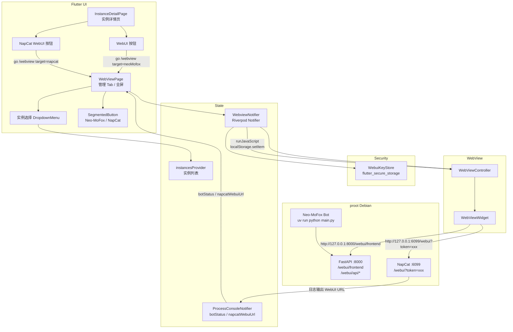
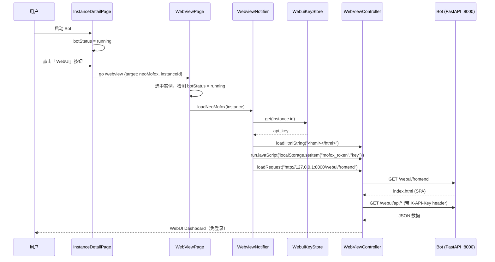
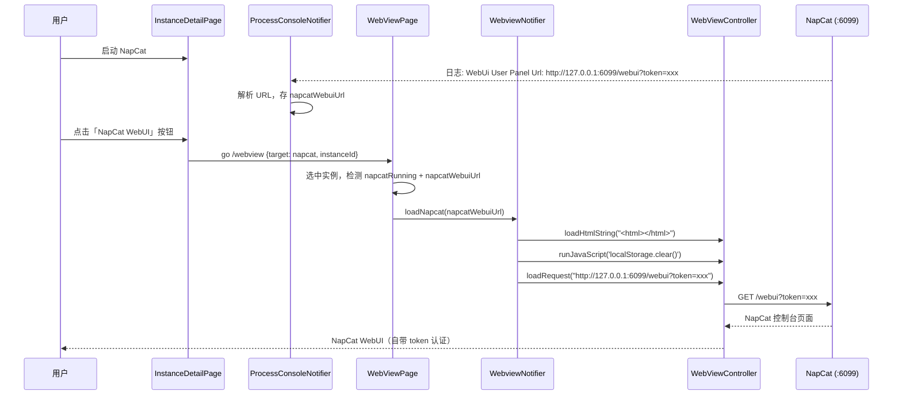

# 内嵌 WebView 访问 Bot WebUI — 架构设计

> 本文档描述在 MoFox-Android 安卓壳内嵌入 WebView，直接访问 Neo-MoFox Bot 实例 WebUI 的完整方案。
> 对应 ARCHITECTURE.md §5.9（WebView 壳）的实现细化。

---

## 1. 背景与目标

### 1.1 现状

- `webview_flutter: ^4.8.0` 依赖已声明，`webview_flutter_android` 构建产物已存在。
- 路由 `/webview` 已注册（`app_router.dart:24`），`WebViewPage` 是纯占位页——`SegmentedButton` 切换 Neo-MoFox / NapCat，body 是文字占位，刷新/浏览器打开按钮空实现。
- 实例详情页 `InstanceDetailPage` 有双 Tab（Bot 日志 / NapCat 日志），无 WebUI Tab。
- WebUI 监听 `127.0.0.1:8000`，首页 URL 是 `http://127.0.0.1:8000/webui/frontend`（不是 `/webui/`）。
- WebUI 认证用 `X-API-Key` 请求头（HTTP API）和 `?api_key=xxx` query 参数（WebSocket），前端登录页输入密钥 → 存 `localStorage["mofox_token"]` → HTTP 客户端自动注入头。
- `Instance` 模型**没有** `webuiApiKey` 字段，密钥只存在于 wizard 的 `InstanceDraft`（内存）和 `core.toml`（rootfs 文件）里，未持久化到实例记录。
- `flutter_secure_storage: ^9.2.2` 已声明依赖但代码中完全未使用。

### 1.2 目标

| 目标 | 说明 |
| --- | --- |
| **免登录** | 用户在 App 内打开 WebUI 不需要手动输入 api_key，自动注入认证 |
| **状态联动** | Bot 未运行时显示占位提示，运行后自动加载 WebUI |
| **密钥安全** | api_key 不明文存 SharedPreferences，用 `flutter_secure_storage`（AndroidKeystore） |
| **多实例** | 每个实例有自己的 api_key，切换实例时 WebView 加载对应密钥 |
| **最小改动** | 复用现有 `WebViewPage` 壳和路由，不新建页面 |

---

## 2. WebUI 认证机制（调研结论）

### 2.1 HTTP API — `X-API-Key` 请求头

```python
# Neo-MoFox: src/core/utils/security/__init__.py
_API_KEY_HEADER_NAME = "X-API-Key"
_api_key_header_auth = APIKeyHeader(name=_API_KEY_HEADER_NAME, auto_error=True)

async def get_api_key(api_key: str = Security(_api_key_header_auth)) -> str:
    valid_keys = config.http_router.api_keys
    if api_key not in valid_keys:
        raise HTTPException(403, "无效的 API 密钥")
    return api_key
```

几乎所有业务端点（60+ 个）用 `VerifiedDep = Depends(get_api_key)` 保护。

### 2.2 WebSocket — `?api_key=xxx` query 参数

```python
@self.app.websocket("/realtime")
async def websocket_endpoint(websocket: WebSocket, api_key: str = Query(...)):
    if api_key not in valid_keys:
        await websocket.close(code=4003, reason="无效的 API 密钥")
```

WebSocket 无法用 header 依赖，改用 query 参数手动校验。

### 2.3 前端密钥流转

```
用户在登录页输入 api_key
  → localStorage.setItem("mofox_token", password)
  → HTTP 客户端自动 s.set("X-API-Key", token)
  → WebSocket URL 拼 ?api_key=xxx
```

### 2.4 静态资源无需认证

`/webui/frontend/*`（SPA 静态文件）用 `SPAStaticFiles` 挂载，**无 `VerifiedDep`**，加载 `index.html`、JS、CSS 不需要 key。认证只发生在后续 API 调用。

### 2.5 CORS

所有 WebUI router 设置 `cors_origins = ["*"]`，无 localhost 特殊处理。

### 2.6 根路径行为

- `GET http://127.0.0.1:8000/` → **404**（主 FastAPI 应用是裸应用，无根路由）
- `GET http://127.0.0.1:8000/webui/` → **404**（没有这个挂载点）
- `GET http://127.0.0.1:8000/webui/frontend` → **200**（SPA 首页，vue-router 内部重定向到 `/webui/frontend/login`）

**正确首页 URL：`http://127.0.0.1:8000/webui/frontend`**

---

## 3. 认证注入方案

### 3.1 方案对比

| 方案 | 做法 | 优点 | 缺点 |
| --- | --- | --- | --- |
| **A. 注入 localStorage** | WebView 加载首页前，用 `runJavaScript` 写 `localStorage["mofox_token"] = key` | 前端逻辑零改动，自动带 header 和 WS query | 需在页面加载前注入，时序控制 |
| **B. URL query 带 key** | URL 拼 `?key=xxx` | 简单 | 前端不读 query param，无效 |
| **C. 拦截请求加 header** | `WebViewCookieManager` / 拦截器给所有请求加 `X-API-Key` | 不改前端 | webview_flutter 4.x 无请求拦截 API |
| **D. 前端登录页自动填** | WebView 加载后自动填入登录页 input | 不改前端 | DOM 结构不稳定，脆弱 |

### 3.2 选定方案：A — 注入 localStorage

**理由**：前端已有完整的 localStorage → header → WS query 流转链路，只需在 WebView 加载首页前把 `mofox_token` 写入 localStorage，前端路由守卫检测到 token 存在会自动跳过登录页进入 dashboard。

### 3.3 注入时序

```
1. WebView 创建
2. 先 loadUrl("about:blank")  ← 确保有 document 上下文
3. runJavaScript('localStorage.setItem("mofox_token", "$key")')
4. loadUrl("http://127.0.0.1:8000/webui/frontend")
5. 前端 vue-router 检测 localStorage 有 token → 跳过 /login → 进 /dashboard
6. 后续 API 请求自动带 X-API-Key header
7. WebSocket 连接自动拼 ?api_key=xxx
```

### 3.4 安全考量

- api_key 通过 `flutter_secure_storage` 存储（AndroidKeystore 加密），不明文落盘。
- WebView 限定 `loadUrl` 白名单为 `127.0.0.1`（ARCHITECTURE.md §9 已声明）。
- `localStorage` 注入只在 `127.0.0.1` 域名下，不跨域泄露。
- 切换实例时清空 localStorage 再注入新 key，避免残留。

---

## 4. 数据模型变更

### 4.1 Instance 模型 — 不加字段

`Instance` 模型**不加** `webuiApiKey` 字段。理由：

- api_key 是敏感信息，不应明文进 SharedPreferences（`InstanceRepository` 用 SharedPreferences 存 JSON）。
- `flutter_secure_storage` 已声明依赖，正好启用。
- `Instance` 只存 `installWebui` 布尔标志（是否安装了 WebUI），密钥单独管理。

### 4.2 密钥存储 — flutter_secure_storage

新建 `app/lib/core/security/webui_key_store.dart`：

```dart
/// 用 flutter_secure_storage 安全存储每个实例的 WebUI api_key。
/// key 格式：`webui_apikey_<instanceId>`。
class WebuiKeyStore {
  static const _storage = FlutterSecureStorage();

  static Future<String?> get(String instanceId) async {
    return _storage.read(key: 'webui_apikey_$instanceId');
  }

  static Future<void> set(String instanceId, String apiKey) async {
    await _storage.write(key: 'webui_apikey_$instanceId', value: apiKey);
  }

  static Future<void> delete(String instanceId) async {
    await _storage.delete(key: 'webui_apikey_$instanceId');
  }
}
```

### 4.3 Wizard 安装完成时写入密钥

`wizard_notifier.dart` 的 `registerInstance` 任务完成后：

```dart
// 安装完成后，把 draft.webuiApiKey 存入 secure storage
if (draft.installWebui && draft.webuiApiKey.isNotEmpty) {
  await WebuiKeyStore.set(instanceId, draft.webuiApiKey);
}
```

### 4.4 删除实例时清理密钥

`InstanceRepository.remove()` 或 Dashboard 删除逻辑中：

```dart
await WebuiKeyStore.delete(instance.id);
```

---

## 5. WebView 控制器管理

### 5.1 WebviewNotifier

新建 `app/lib/features/webview/application/webview_notifier.dart`：

```dart
class WebviewNotifier extends Notifier<WebViewController> {
  @override
  WebViewController build() {
    final controller = WebViewController()
      ..setJavaScriptMode(JavaScriptMode.unrestricted);

    unawaited(controller.setNavigationDelegate(
      NavigationDelegate(
        onNavigationRequest: (req) {
          // 只允许 127.0.0.1 / localhost，外部链接交给系统浏览器
          final host = Uri.tryParse(req.url)?.host ?? '';
          if (host == '127.0.0.1' || host == 'localhost' ||
              req.url.startsWith('about:')) {
            return NavigationDecision.navigate;
          }
          unawaited(launchUrl(Uri.parse(req.url)));
          return NavigationDecision.prevent;
        },
      ),
    ));
    return controller;
  }

  /// 加载 Neo-MoFox WebUI（注入 localStorage api_key）。
  Future<void> loadNeoMofox(Instance instance) async {
    final apiKey = await WebuiKeyStore.get(instance.id);
    final controller = state;
    // 1. 先加载空白页确保有 document 上下文
    await controller.loadHtmlString(
      '<html><body></body></html>',
      baseUrl: 'http://127.0.0.1:8000/',
    );
    // 2. 注入 localStorage（清旧再写新）
    if (apiKey != null && apiKey.isNotEmpty) {
      await controller.runJavaScript(
        'localStorage.clear();'
        'localStorage.setItem("mofox_token", "${_escapeJs(apiKey)}")',
      );
    }
    // 3. 加载 WebUI 首页
    await controller.loadRequest(
      Uri.parse('http://127.0.0.1:8000/webui/frontend'),
    );
  }

  /// 加载 NapCat WebUI（URL 自带 token，无需额外注入）。
  Future<void> loadNapcat(String webuiUrl) async {
    final controller = state;
    await controller.loadHtmlString(
      '<html><body></body></html>',
      baseUrl: 'http://127.0.0.1:6099/',
    );
    await controller.runJavaScript('localStorage.clear();');
    await controller.loadRequest(Uri.parse(webuiUrl));
  }

  Future<void> reload() => state.reload();
  Future<void> openInBrowser(String url) => launchUrl(Uri.parse(url));
}
```

### 5.2 生命周期

- WebView 控制器随 `WebViewPage` 的生命周期创建销毁。
- 切换实例时调 `loadNeoMofox(newInstance)`，会先清旧 localStorage 再注入新 key。
- Bot 停止时 WebView 不销毁，但页面会因 API 请求失败显示错误态（前端处理）。
- NapCat 停止时 `napcatWebuiUrl` 被清空，WebView 显示占位提示。

---

## 6. UI 集成方案

### 6.1 方案选择：改造 WebViewPage（管理 Tab）+ 实例详情页按钮入口

改造现有 `/webview` 路由的 `WebViewPage` 作为全屏 WebView 容器，同时在 `InstanceDetailPage` 加两个按钮（WebUI / NapCat WebUI），点击后带 `target` + `instanceId` 参数跳转到 WebViewPage，自动选中对应实例和 target。

**理由**：

- `WebViewPage` 已有 SegmentedButton 切换 Neo-MoFox / NapCat 的壳，改造成本低。
- WebUI 是全屏体验，放在管理 Tab 比挤在实例详情页的 Tab 里更合理。
- 实例详情页已有日志 Tab，WebUI 是另一种交互形态，分开更清晰。
- 实例详情页加按钮提供快捷入口，用户启动 Bot/NapCat 后一键打开对应 WebUI。
- ARCHITECTURE.md §5.9 已规划 WebView 壳在管理 Tab。

### 6.2 WebViewPage 改造

```
WebViewPage（改造后，接受路由参数 initialTarget / initialInstanceId）
├── AppBar
│   ├── 标题：当前实例名 / "管理"
│   ├── 刷新按钮 → webviewNotifier.reload()
│   ├── 在浏览器打开 → url_launcher 打开对应 URL
│   └── bottom: Column
│       ├── 实例选择 DropdownMenu（多实例时显示）
│       └── SegmentedButton（Neo-MoFox / NapCat 切换）
└── Body
    ├── Neo-MoFox 模式
    │   ├── 未安装 WebUI → 占位提示
    │   ├── Bot 未运行 → 占位提示"请先启动 Bot"
    │   └── Bot 运行中 → WebViewWidget 加载 /webui/frontend
    └── NapCat 模式
        ├── NapCat 未运行 → 占位提示
        ├── 等待 WebUI URL → 占位提示
        └── 有 URL → WebViewWidget 加载 napcatWebuiUrl
```

### 6.3 实例详情页按钮入口

`InstanceDetailPage` 在启动/停止/重启按钮行下方加一行两个按钮：

```dart
// WebUI 按钮（Bot 运行中 + 安装了 WebUI 时可用）
FilledButton.tonalIcon(
  onPressed: (installed && !busy && botRunning && instance.installWebui)
    ? () => context.go(AppRoute.webview, extra: {
        'target': 'neoMofox',
        'instanceId': instance.id,
      })
    : null,
  icon: Icon(Icons.dashboard_outlined),
  label: Text('WebUI'),
),

// NapCat WebUI 按钮（NapCat 运行中 + 安装了 NapCat 时可用）
FilledButton.tonalIcon(
  onPressed: (installed && !busy && napcatRunning && instance.installNapcat)
    ? () => context.go(AppRoute.webview, extra: {
        'target': 'napcat',
        'instanceId': instance.id,
      })
    : null,
  icon: Icon(Icons.qr_code_2_outlined),
  label: Text('NapCat WebUI'),
),
```

### 6.4 路由参数

`app_router.dart` 的 `/webview` 路由接受 `extra` Map：

```dart
GoRoute(
  path: AppRoute.webview,
  builder: (_, state) {
    final extra = state.extra as Map<String, dynamic>?;
    return WebViewPage(
      initialTarget: extra?['target'] as String?,
      initialInstanceId: extra?['instanceId'] as String?,
    );
  },
),
```

`WebViewPage` 构造函数接受 `initialTarget`（`'neoMofox'` / `'napcat'`）和 `initialInstanceId`，初始化时选中对应 target 和实例。

---

## 7. 网络安全配置

### 7.1 cleartext 例外

WebUI 走 `http://127.0.0.1:8000`（明文 HTTP），需要在 `AndroidManifest.xml` 的 `networkSecurityConfig` 里对 `127.0.0.1` 开 cleartext 例外。

检查 `app/android/app/src/main/res/xml/network_security_config.xml`（如果不存在则创建）：

```xml
<?xml version="1.0" encoding="utf-8"?>
<network-security-config>
    <domain-config cleartextTrafficPermitted="true">
        <domain includeSubdomains="false">127.0.0.1</domain>
        <domain includeSubdomains="false">localhost</domain>
    </domain-config>
</network-security-config>
```

`AndroidManifest.xml` 引用：

```xml
<application
    android:networkSecurityConfig="@xml/network_security_config"
    ...>
```

### 7.2 WebView 安全设置

```dart
await controller.setPlatformNavigationDelegate(
  NavigationDelegate(
    onNavigationRequest: (req) {
      // 只允许 127.0.0.1 和 about:blank
      if (req.url.startsWith('http://127.0.0.1') ||
          req.url.startsWith('about:')) {
        return NavigationDecision.navigate;
      }
      // 外部链接交给系统浏览器
      launchUrl(Uri.parse(req.url));
      return NavigationDecision.prevent;
    },
  ),
);
```

---

## 8. 实施步骤

### Phase 1：密钥存储（前置）

| 步骤 | 文件 | 改动 |
| --- | --- | --- |
| 1.1 | `pubspec.yaml` | 确认 `flutter_secure_storage: ^9.2.2` 已声明（✅ 已有） |
| 1.2 | 新建 `app/lib/core/security/webui_key_store.dart` | `WebuiKeyStore` 类，get/set/delete |
| 1.3 | `wizard_notifier.dart` | `registerInstance` 完成后调 `WebuiKeyStore.set(id, key)` |
| 1.4 | `dashboard_page.dart` | 删除实例时调 `WebuiKeyStore.delete(id)` |

### Phase 2：WebView 控制器

| 步骤 | 文件 | 改动 |
| --- | --- | --- |
| 2.1 | 新建 `app/lib/features/webview/application/webview_notifier.dart` | `WebviewNotifier`，loadNeoMofox/loadNapcat/reload |
| 2.2 | `webview_notifier.dart` | localStorage 注入逻辑 + URL 白名单导航委托 |
| 2.3 | `process_console_provider.dart` | 加 `napcatWebuiUrl` 字段，从日志解析 URL，进程退出时清空 |

### Phase 3：WebViewPage 改造

| 步骤 | 文件 | 改动 |
| --- | --- | --- |
| 3.1 | `webview_page.dart` | 改为 `ConsumerStatefulWidget`，接受 `initialTarget` / `initialInstanceId` |
| 3.2 | `webview_page.dart` | 加实例选择器（DropdownMenu） |
| 3.3 | `webview_page.dart` | body 替换占位为 `WebViewWidget`，Neo-MoFox / NapCat 双模式 |
| 3.4 | `webview_page.dart` | bot/napcat 运行状态判断 + 占位提示 |
| 3.5 | `webview_page.dart` | 刷新按钮接 `reload()`，浏览器打开接 `url_launcher` |
| 3.6 | `app_router.dart` | `/webview` 路由接受 `extra` Map 传 target/instanceId |

### Phase 4：实例详情页按钮入口

| 步骤 | 文件 | 改动 |
| --- | --- | --- |
| 4.1 | `instance_detail_page.dart` | 加 WebUI 按钮（Bot 运行中可用）→ 跳转 webview target=neoMofox |
| 4.2 | `instance_detail_page.dart` | 加 NapCat WebUI 按钮（NapCat 运行中可用）→ 跳转 webview target=napcat |

### Phase 4：网络安全配置

| 步骤 | 文件 | 改动 |
| --- | --- | --- |
| 4.1 | `res/xml/network_security_config.xml` | 127.0.0.1 cleartext 例外（如不存在则创建） |
| 4.2 | `AndroidManifest.xml` | 引用 networkSecurityConfig（如未引用） |

### Phase 5：验证

| 步骤 | 验证内容 |
| --- | --- |
| 5.1 | 创建实例 → 确认 api_key 写入 secure storage |
| 5.2 | 启动 bot → 实例详情页点「WebUI」按钮 → WebUI 自动加载，免登录进 dashboard |
| 5.3 | 停止 bot → WebUI 显示占位提示 |
| 5.4 | 切换实例 → WebUI 加载新实例的 WebUI |
| 5.5 | 删除实例 → 确认 secure storage 中 api_key 已清理 |
| 5.6 | 启动 NapCat → 实例详情页点「NapCat WebUI」按钮 → 加载 NapCat 控制台（自带 token） |
| 5.7 | 停止 NapCat → WebUI 显示占位提示，napcatWebuiUrl 清空 |

---

## 9. 文件清单

### 新建文件

| 文件 | 用途 |
| --- | --- |
| `app/lib/core/security/webui_key_store.dart` | WebUI api_key 安全存储 |
| `app/lib/features/webview/application/webview_notifier.dart` | WebView 控制器 + localStorage 注入 |

### 修改文件

| 文件 | 改动 |
| --- | --- |
| `app/lib/features/wizard/application/wizard_notifier.dart` | 安装完成写 api_key 到 secure storage |
| `app/lib/features/dashboard/presentation/dashboard_page.dart` | 删除实例时清理 api_key |
| `app/lib/features/dashboard/application/process_console_provider.dart` | 加 `napcatWebuiUrl` 字段，从日志解析 URL，进程退出时清空 |
| `app/lib/features/webview/presentation/webview_page.dart` | 改造为真实 WebView，接受路由参数 |
| `app/lib/features/instance/presentation/instance_detail_page.dart` | 加 WebUI / NapCat WebUI 两个按钮入口 |
| `app/lib/app/router/app_router.dart` | `/webview` 路由接受 `extra` Map 传 target/instanceId |
| `app/android/app/src/main/res/xml/network_security_config.xml` | 127.0.0.1 cleartext 例外（可能需新建） |
| `app/android/app/src/main/AndroidManifest.xml` | 引用 networkSecurityConfig（如未引用） |

### 不改动文件

| 文件 | 理由 |
| --- | --- |
| `app/lib/features/instance/domain/instance.dart` | 不加 api_key 字段，密钥单独管理 |
| `app/lib/features/instance/application/instance_repository.dart` | 不涉及密钥，只管实例元数据 |
| `app/android/app/src/main/kotlin/com/mofox/android/runtime/RuntimeScripts.kt` | WebUI 安装脚本已正确，无需改 |

---

## 10. 风险与对策

| 风险 | 对策 |
| --- | --- |
| **localStorage 注入时序** | 先 `loadHtml` 空页面确保有 document 上下文，再 `runJavaScript` 写 localStorage，最后 `loadRequest` 真实 URL |
| **WebView 缓存旧 key** | 切换实例时先 `runJavaScript('localStorage.clear()')` 再注入新 key |
| **Bot 未运行时 WebView 白屏** | 在 Dart 侧判断 `botStatus`，未运行时不加载 WebView，显示占位提示 |
| **WebUI 前端版本更新改 localStorage key 名** | key 名 `mofox_token` 是前端硬编码的，如果上游改名需要同步更新注入逻辑 |
| **多实例同时运行** | 当前 `ProcessConsoleNotifier` 是全局单例，同时只能跟踪一个 bot 进程。多实例运行是后续需求，当前单实例场景下 WebView 方案可行 |
| **WebView 内存占用** | WebView 不在实例详情页内嵌，放在管理 Tab 全屏使用，切走时 WebView 挂起不销毁，回来时恢复 |
| **NapCat WebUI** | 已实现：从 napcat 日志解析 `WebUi User Panel Url: http://127.0.0.1:6099/webui?token=xxx`，URL 自带 token 直接加载，无需额外注入。NapCat 停止时清空 `napcatWebuiUrl`。 |

---

## 11. 架构图



---

## 12. 时序图

### 12.1 Neo-MoFox WebUI



### 12.2 NapCat WebUI



---

## 13. 与 ARCHITECTURE.md 的关系

本文档是 ARCHITECTURE.md §5.9（WebView 壳）的实现细化。实施完成后需回写 ARCHITECTURE.md：

- §5.9 更新：从"占位"改为"已实现"，补充 localStorage 注入方案和密钥存储。
- §9 安全：补充 `flutter_secure_storage` 实际使用情况。
- §5.7 实例详情：补充 WebUI / NapCat WebUI 按钮入口，跳转到管理 Tab 的 WebViewPage。
- §7 目录结构：补充新建的 `core/security/` 和 `features/webview/application/`。
